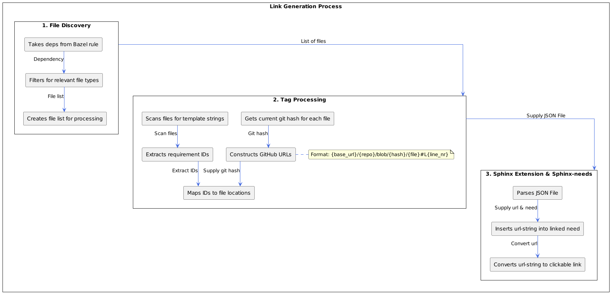

# Source Link Extension Details

A Sphinx extension for source code traceability for requirements. This extension works with the Bazel system and Sphinx-needs to provide automatic source code traceability.
In a first step it parses the source code for requirement tags. All discovered tags including their file and line numbers are written in an intermediary file before the sphinx build.
In a second step this intermediary file is parsed during sphinx build. If a requirement Id is found in the intermediary file a link to the source is added.

## Implementation Components

### Bazel Integration
The extension uses two main components to integrate with bazel:

1. `collect_source_files`
   - Processes all files from provided deps
   - Passes files as `--input` arguments to `parse_source_files.py`
   - Handles dependency tracking for incremental builds

2. `parse_source_files.py`
   - Scans input files for template tags (e.g., `# req-traceability:`)
   - Retrieves git information (hash, file location)
   - Generates mapping file with requirement IDs and links

### Link Generation Process

1. File Discovery:
   - Takes deps from Bazel rule
   - Filters for relevant file types
   - Creates file list for processing

<br>

2. Tag Processing:
   - Scans files for template strings
   - Extracts requirement IDs
   - Maps IDs to file locations
   - *Git Integration*:
       - Gets current git hash for each file
       - Constructs GitHub URLs with format:
         `{base_url}/{repo}/blob/{hash}/{file}#L{line_nr}`
        **Note:** The base_url is defined in `parse_source_files.py`. Currently set to: `https://github.com/eclipse-score/score/blob/`  

Produces JSON mapping file:
```json
{
    "REQ_ID": [
        "github_link1",
        "github_link2"  // If multiple code-links exist
    ]
}
```

<br>

3. Sphinx extension & Sphinx-needs:
    - Parses JSON file
    - Adds 'url-string' to needs
    - Converts 'url-string' to clickable link

<hr>

> An overview of the data flow inside the extension and it's parts



---


### Sphinx Integration
The extension hooks into Sphinx's build process. It attaches to the `env-updated` event.

1. Configuration Phase:
   - Registers as Sphinx extension
   - Reads mapping file
   - Sets up sphinx-needs integration

2. Build Phase:
   - Processes each need
   - Adds source_code_link option to matching needs
   - Handles needs_string_links conversion

3. Error Handling:
   - Validates requirement IDs
   - Provides descriptive warnings for missing IDs

## Usage Guide

### Adding Places to Search

You can easily add files to be searched by adding targets / files to the deps inside the 
`collect_source_files_for_score_source_code_linker` in `docs/BUILD`.
See here:

```starlark
collect_source_files_for_score_source_code_linker(
    name = "collected_files_for_score_source_code_linker",
    deps = [
        ":score_metamodel",
        ":score_source_code_linker",
        # Add targets to be parsed here
    ],
)
```

### Adding Tags to Source Files

In order for a source_code_link to be generated there needs to be a **tag** inside the parsed file.
Tags are defined inside `parse_source_files.py`

You can use them like this:

```python
# req-traceability: <NEED ID YOU WANT TO LINK TO>
def dummy_function():
    pass
```

This will then add a link to this source file to the need you specified.

**Warning:** If the need-id you specified in the tag, does **not** exist in the needs, the extension will give an error message.
Therefore stopping the sphinx-build.
The error message looks similar to this:

```
WARNING: Could not find TREQ_ID_200 in the needs id's. Found in file(s):['_tooling/score_metamodel/bad_implementation.py']
```

### Quickly Finding Source Links

The easiest and quickest way to find source_code_link options is to just search for the option `source_code_link`. It should give you all rst files 
where the option is not empty.

### Executing Tests

If you want to specifically execute the test suite for the extension please use the following command:
```bash
bazel test //docs:score_source_code_link_tests
```

The test suite should also run if you run all tests via `bazel test //...`

## Known Limitations

1. Esbonio Compatibility:
   - Does not work with Language Server
   - Skipped for performance reasons in instant feedback mode

2. Local Development:
   - Links to unpushed commits return 404
   - Links still generated but non-functional until push

3. Build Process:
   - source_code_link not visible in raw RST
   - Requires full build cycle for link generation
   - Dependent on GitHub repository structure

## Internal Architecture


1. `collect_source_files`:
   - Dependency management
   - File filtering
   - Build rule definition

2. `parse_source_files.py`:
   - File parsing
   - Git integration
   - Link generation

3. `source_link` extension:
   - Sphinx integration
   - Need modification

Tests are inside the `source_link/tests`
