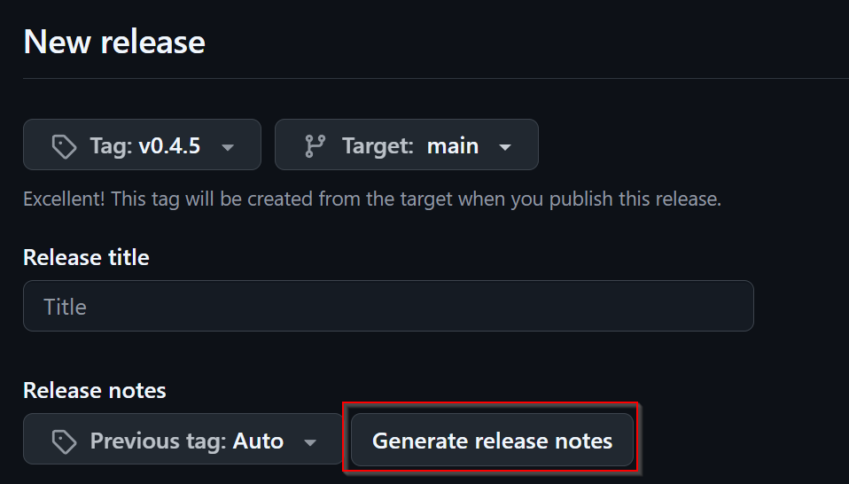
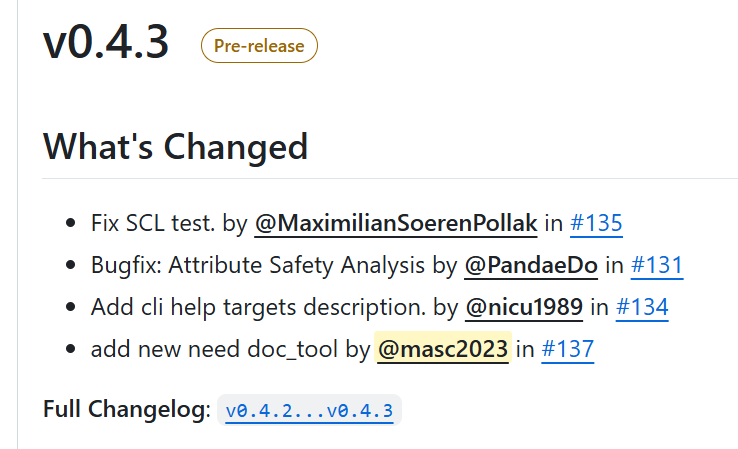

..
   # *******************************************************************************
   # Copyright (c) 2025 Contributors to the Eclipse Foundation
   #
   # See the NOTICE file(s) distributed with this work for additional
   # information regarding copyright ownership.
   #
   # This program and the accompanying materials are made available under the
   # terms of the Apache License Version 2.0 which is available at
   # https://www.apache.org/licenses/LICENSE-2.0
   #
   # SPDX-License-Identifier: Apache-2.0
   # *******************************************************************************

.. _module_release_manual:

Module Release Manual
=====================

Overview
--------

In order to use different Modules via the Bazel ecosystem, the Modules have to be released and registered in the S-CORE Bazel Registry.
This short manual will show you the steps necessary to create a release and make it available for other Bazel Modules.

Prerequisites
-------------

Before starting the release process, ensure you have:

- Write access to the GitHub repository which contains the to be released Module
- Access & ability to create pr's (via Fork or otherwise) to the `S-CORE Bazel registry repository <https://github.com/eclipse-score/bazel_registry>`_
- All necessary changes merged into the main branch
- Understanding of semantic versioning principles

For further and more detailed information take a look at the :need:`doc__platform_release_management_plan`.

Module Release Process
----------------------

1. Verify Main Branch Status
~~~~~~~~~~~~~~~~~~~~~~~~~~~~

Navigate to your GitHub repository and ensure that all wanted changes are merged into the main branch.

2. Update MODULE.bazel Version
~~~~~~~~~~~~~~~~~~~~~~~~~~~~~~

Ensure that the ``MODULE.bazel`` version matches the version you are about to release:

.. code-block:: python

   module(
       name = "your_module_name",
       version = "x.y.z",  # This should match your release tag
       compatibility_level = 0,
   )

.. important::
   *If the version in the MODULE.bazel is different from the one you want to release, you need to update them to match*

Follow semantic versioning (SemVer) principles:

* **MAJOR**: Incremented for incompatible API changes.

* **MINOR**: Incremented for backward-compatible functionality additions.

* **PATCH**: Incremented for backward-compatible bug fixes.

For a more detailed description of when to update which version look at the "Identification" section of :need:`doc__platform_release_management_plan`

If you have a major version change that **breaks** backwards compatibility, then make sure to also increase the
compatibility level inside the MODULE.bazel file.

The compatibility level should be the lowest supported major version that this new version is still compatible with.

1. Create GitHub Release
~~~~~~~~~~~~~~~~~~~~~~~~

 Create a new release:

a. Go to the GitHub repository page
b. On the right-hand side, click 'Create a new release'

   .. image:: _assets/Github_release_button.png
      :width: 800
      :alt: Github Release Button Location

.. note:: Your Release button might look different

   .. image:: _assets/Releases_other_way.png
      :width: 800
      :alt: Github Release Alternate Look

**If this is the case, you then can create a new release via this button on the following screen.**

.. image:: _assets/Releases_other_way_button.png
   :width: 800
   :alt: Github Release Alternate Look Page 2

|

c. Create a release tag

Create a new tag following the format ``vx.y.z`` (e.g., ``v1.2.3``):

- The tag should match exactly with the version in ``MODULE.bazel``
- Use the ``v`` prefix for consistency
- Target the main branch

   .. image:: _assets/Release_select_tag.png
      :width: 800
      :alt: Tag Selector Location

   .. image:: _assets/Create_tag_on_publish.png
      :width: 800
      :alt: Creating Tag On Publish

5. Write Release Notes
~~~~~~~~~~~~~~~~~~~~~~

Add meaningful release notes that document the changes you made since your last release.

You can use the generate release notes button to get a good starting point.

This then will give you something similar to this:

For an official release (note) you need to consider the :need:`doc__platform_release_management_plan`
and follow the process as in :need:`gd_guidl__rel_management`.

6. Set Pre-release Status (if applicable)
~~~~~~~~~~~~~~~~~~~~~~~~~~~~~~~~~~~~~~~~~~

Ensure all entered information is correct before you release. Check the pre-release box if necessary

   .. image:: _assets/Overview_before_release.png
      :width: 800
      :alt: Github Repository Overview

7. Register in Bazel Central Registry
~~~~~~~~~~~~~~~~~~~~~~~~~~~~~~~~~~~~~

After publishing the GitHub release in the Module repository, you need to add the Module to the Bazel Central Registry:

8.1 Copy MODULE.bazel
"""""""""""""""""""""

Copy the ``MODULE.bazel`` file from your released version to the registry structure:

.. code-block:: bash

   # Navigate to your local copy of the Bazel Central Registry
   cd bazel-central-registry

   # Create the module directory structure if it doesn't exist
   mkdir -p modules/your_module_name/x.y.z

   # Copy the MODULE.bazel file
   cp /path/to/your/project/MODULE.bazel modules/your_module_name/x.y.z/

8.2 Calculate Archive Hash
"""""""""""""""""""""""""""

Calculate the SHA256 hash of the release archive via the following command:

.. code-block:: bash

   curl -Ls  "https://github.com/your_org/your_repo/archive/refs/tags/vx.y.z.tar.gz" | sha256sum | awk '{ print $1 }' | xxd -r -p | base64 | sed 's/^/sha256-/'

   # output will look something like this:
   # sha256-s48hf6x3E7XvwgnrDMnKI/97PZju4haQnF0AnPXK9VE=

Here is a convenient function to calculate the hash that you can add to your .bashrc file

.. code-block:: bash

   function calcHash() {
      curl -Ls "$1" | sha256sum | awk '{ print $1 }' | xxd -r -p | base64 | sed 's/^/sha256-/'
   }

   # use it like so:

   calcHash "https://github.com/your_org/your_repo/archive/refs/tags/vx.y.z.tar.gz"
   # It will then give you the correct sha you can use for the source.json
   # e.g. sha256-s48hf6x3E7XvwgnrDMnKI/97PZju4haQnF0AnPXK9VE=

8.3 Create source.json
"""""""""""""""""""""""

Create a ``source.json`` file in the module version directory:

.. code-block:: json
   :caption: Example source.json file

   {
       "integrity": "<calculated_hash>",
       "strip_prefix": "your_repo_name-x.y.z",
       "url": "https://github.com/your_org/your_repo/archive/refs/tags/vx.y.z.tar.gz"
   }

**Note**: The ``strip_prefix`` should match the top-level directory name in the archive, which is typically ``repository_name-version``.

9 Add Release to metamodel.json
~~~~~~~~~~~~~~~~~~~~~~~~~~~~~~~

Inside `modules/your_module_name/` if not already there create a metamodel.json file,
add your release version to it.

Here is an example file

.. code-block:: json
   :caption: Example metadata.json file

   {
    "homepage": "<the homepage of your repository / documentation>",
    "maintainers": [
        {
            "name": "<Name>",
            "email": "<E-Mail>",
            "github": "<Github Username>",
            "github_user_id": "<Your GH User ID as NUMBER>"
        }
    ],
    "repository": [
        "github:<your-org>/<your-repo>"
    ],
    "versions": [
        "0.0.7",
        "0.0.8",
        "0.1.0"
    ],
    "yanked_versions": {}
   }

10. Verify Module Registration & Create a PR
~~~~~~~~~~~~~~~~~~~~~~~~~~~~~~~~~~~~~~~~~~~~

Before submitting your changes, verify that the Module is correctly configured:

.. code-block:: bash

   # In the bazel-central-registry directory
   bazel run //tools:verify_modules

This command will:
- Validate the Module structure
- Check that all files are present and correctly formatted
- Verify that the archive can be downloaded and extracted
- Ensure the Module can be built successfully

If everything is green, create a PR that includes your changes.

.. note:: This just does the same test that the CI does. This is a helper to find issues locally before pushing the changes.

Your Module Should now Be Available
~~~~~~~~~~~~~~~~~~~~~~~~~~~~~~~~~~~

Once your pull request is merged into the main branch of the Bazel Central Registry, your Module becomes available for use as a dependency in any other Bazel project.

Users can now add your Module to their ``MODULE.bazel`` file:

.. code-block:: python

   bazel_dep(name = "your_module_name", version = "x.y.z")

   # example
   # bazel_dep(name = "score_process", version = "1.0.4")
