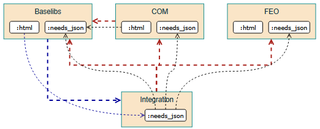

..
   Copyright (c) 2025 Contributors to the Eclipse Foundation

   See the NOTICE file(s) distributed with this work for additional
   information regarding copyright ownership.

   This program and the accompanying materials are made available under the
   terms of the Apache License Version 2.0 which is available at
   https://www.apache.org/licenses/LICENSE-2.0

   SPDX-License-Identifier: Apache-2.0

DR-004-Infra: Bi-directional traceability in docs
=================================================

.. dec_rec:: Bi-directional traceability in docs
   :id: dec_rec__infra__traceable_docs
   :status: accepted
   :context: Infrastructure
   :decision: Single documentation build

   Date: 2025-10-24

Context / Problem
-----------------

The S-CORE project adopted a multi-repo strategy.
Since `S-CORE aims for compliance with regulations like ASPICE <https://eclipse-score.github.io/process_description/main/standards/index.html#standards>`_,
bi-directional traceability is necessary (see ``gd_req__req_traceability``) and should be made convenient.
How to provide this in S-CORE documentation?

Previously, there was this unfinished
`Decision Record: Multi-Repository Documentation Setup in SCORE <https://github.com/AlexanderLanin/score/blob/docs-multirepo/docs/_tooling/decision-records/multirepo.md>`_.

For discussion, this subset of S-CORE modules shall serve as an example:

.. image:: img/DR-004-example.png

Goals and Requirements
^^^^^^^^^^^^^^^^^^^^^^

1. We want to enable each module to work independently and efficiently, i.e. build their own documentation quickly.
2. We want a complete and consistent documentation for a release, i.e. everything with backlinks.
   Regulations only require that *eventually* though and during development slight inconsistencies are acceptable.
3. Some modules want backlinks even if it slows down the doc build.
   For example, Platform wants backlinks for the feature requirements.
   For contrast, Baselibs may not require backlinks because they simply assume that everybody uses them.

Non-Goals
~~~~~~~~~

* `#258 <https://github.com/eclipse-score/docs-as-code/issues/258>`_: The repository layout for documentation is not relevant here.
* `#259 <https://github.com/eclipse-score/docs-as-code/issues/259>`_: Whether only certain rst files should contain needs elements is not relevant here.
* `#260 <https://github.com/eclipse-score/docs-as-code/issues/260>`_: Whether Bazel should handle the creation of some documentation artifacts is not relevant here.
* `#261 <https://github.com/eclipse-score/docs-as-code/issues/261>`_: Whether Bazel should configure documentation variants is not relevant here.
* Referencing Sphinx elements apart from Needs is not relevant here because such links are never bi-directional.

Module vs Target dependencies
^^^^^^^^^^^^^^^^^^^^^^^^^^^^^

To understand how backlinks do not imply circular dependencies we must understand the difference between module and target dependencies.

*If* Baselibs wants to see backlinks (i.e. COM references) in their documentation, they need to introduce the blue dependencies below:

There is an additional module dependency to the Integration module.
This is circular because Integration also uses the Baselibs module.
This just makes all their targets visible to each other.

There is an additional target dependency from @Baselibs:html to @Integration:needs_json which contains *all* needs-elements of the S-CORE project.
There is no circular dependency among target dependencies.
Bazel would show an error if you try.

Options Considered
------------------

Option S: Single documentation build
^^^^^^^^^^^^^^^^^^^^^^^^^^^^^^^^^^^^

Collect the documentation from all repositories and build a single huge html website.

A prototype is available in `a-zw/score_full-docs <https://github.com/a-zw/score_full-docs/tree/61205c616a99e395e0f63fb995bd828271433b44>`_.

Current implementation for external needs means modules reference external ids with a prefix.
This prefixed id does not exist in a mega-build which results in Sphinx warnings.

💚  Effort: Proof-of-concepts exist, so the basic implementation should be quick.

😡  Bureaucracy: Modules must not use prefixes for external needs because it breaks the integration build.
The docs-as-code repo must be refactored accordingly.
Since the id schemas already contain namespacing rules, there is barely any risk of id clashes.

😡  Speed: This will result a long-running build step unsuitable for pull requests in general.
This only affects the final integration build.
Everybody else can independently chose their sweet spot between bi-directional link convenience and build speed.

💚  UX: While the integration documentation is huge, it has a unified configuration and navigation is consistent.

Option M: Module documentation rebuilt
^^^^^^^^^^^^^^^^^^^^^^^^^^^^^^^^^^^^^^

Sphinx provides `intersphinx <https://www.sphinx-doc.org/en/master/usage/extensions/intersphinx.html>`_
and Sphinx-Needs provides `needs-external-needs <https://sphinx-needs.readthedocs.io/en/stable/configuration.html#needs-external-needs>`_
for linking between different documentations.
By using them on both sides, bi-directional traceability can be achieved without circular dependencies.

The documentation of a single module may be outdated with respect to external needs, i.e. backlinks.
Just imagine a new module is created which uses Baselibs but Baselibs makes no changes, so the documentation is never rebuilt.

This implies that the integration module must build all documentation themselves for a release.
While it might seem redundant if we already have the independent module's docs, this is necessary to ensure consistency.

Since modules might reference older versions of other modules, integration may be forced to override versions.
This is an additional reason for a rebuild.

😡  Effort: We have no proof-of-concept yet. Especially one which provides a live-preview with multiple modules.

💚  Bureaucracy: Modules decide about prefixes for themselves.

💚  Speed: This should build faster because we can rebuild modules in parallel.

😡  UX: Navigating between modules may be confusing since the navigation and whatnot changes.

Evaluation
----------

.. csv-table::
   :header: Criteria, Option S, Option M
   :widths: 20, 10, 10

   Effort, 💚, 😡
   UX, 💚, 😡
   Bureaucracy, 😡, 💚
   Speed, 😡, 💚

There is no particularly strong criterium, thus we pick option S because it can be done quickly.
