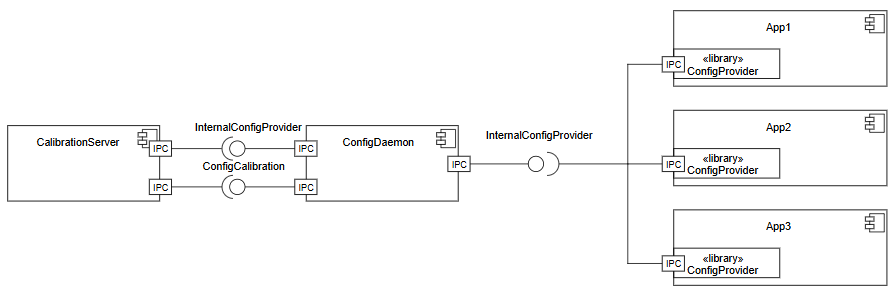

..
   # *******************************************************************************
   # Copyright (c) 2025 Contributors to the Eclipse Foundation
   #
   # See the NOTICE file(s) distributed with this work for additional
   # information regarding copyright ownership.
   #
   # This program and the accompanying materials are made available under the
   # terms of the Apache License Version 2.0 which is available at
   # https://www.apache.org/licenses/LICENSE-2.0
   #
   # SPDX-License-Identifier: Apache-2.0
   # *******************************************************************************

.. _config_mgmt_feature:

Configuration Management
========================

.. document:: Configuration Management
   :id: doc__config_mgmt
   :status: draft
   :safety: ASIL_B
   :security: YES
   :tags: contribution_request, feature_request
   :realizes: wp__feat_request

.. toctree::
   :hidden:

   requirements/index.rst

Feature flag
------------

To activate this feature, use the following feature flag:

``experimental_config_mgmt``

Abstract
--------

Configuration Management feature is responsible for central storage, verification and modification of individual vehicle configuration properties. A generic interface for applications to access such properties is part of the feature.

Motivation
----------

Embedded software usually needs specific adaptations to a particular vehicle in terms of configuration properties. Such configuration properties are called ``parameters`` in the following abstract. Examples of parameters are vehicle geometry or geographical region of use. Parameters are used in manifold computations and are expected to be constant during a driving cycle in customers' hand.
Currently we differentiate between two kinds of parameters depending on type of configuration and related development process: coding parameters and calibration parameters.

``ConfigDaemon`` application implements an on-target data base for all parameters used in a particular ECU and a generic interface for parameter accesses by user applications.

The basic idea of ``ConfigDaemon`` is justified by the use case of having only flexible runtime dependencies on parameters from the viewpoint of a user application. Generic interface to access a parameter is defined by key-value principle, where key is a unique name for a required parameter and value is any data related to this name. Runtime dependencies have an added value in comparison to statically defined interfaces for every specific parameter, which must be resolved at build time. This approach allows to shorten build times and avoids the necessity of system model changes and following re-builds if a parameter changes.

``ConfigDaemon`` is internally structured as

- an application, which implements a parameter data base and interface for parameter access and
- additional plugins, which handle specific kinds of parameters according to OEM functional requirements, like
- coding plugin or
- calibration plugin

Flexibility of the generic interface is achieved by representation of any parameter value as a string. To convert the string representation to the original data type of a parameter an additional library ``ConfigProvider`` is offered. ``ConfigProvider`` is supposed to be integrated in a user application. ``ConfigProvider``, thus, is responsible for

- establishing of communication to ``ConfigDaemon``,
- receiving eventual parameter updates,
- providing of typed access methods to parameters towards a user application.

Rationale
---------

No objections or concerns raised yet.

Specification
-------------

``InternalConfigProviderService`` passes parameter data as json string to satisfy :need:`feat_req__config_mgmt__provider_interface`.

``ConfigProvider`` library translates such a json string in a typed parameter accessible by its name from user application according to :need:`feat_req__config_mgmt__parameter_set_access`.

``InternalConfigProviderService`` makes the usage of methods, events and fields. For instance

- ``method GetParameterSet { in { String parameter_set_name } out { String parameter_set } }`` returns a parameter set in JSON representation in terms of :need:`feat_req__config_mgmt__parameter_set_access`
- ``attribute InitialQualifierState InitialQualifierState readonly`` field provides qualifier state in terms of :need:`feat_req__config_mgmt__prm_initial_qualifier`
- ``broadcast LastUpdatedParameterSet { out { ParameterSetName last_updated_parameter_set } }`` event notifies users in case a parameter set has been changed (updated) according to :need:`feat_req__config_mgmt__parameter_modification`.

``LoLa`` can be used for IPC communication as soon as methods get supported.

``ConfigDaemon`` uses the file system via ``json library`` to write and read files which contain parameters.

Plugin infrastructure may have further dependencies, like ``SOVD`` for ``Coding`` or persistent key-value storage.

Backwards Compatibility
-----------------------

No compatibility requirements imposed yet.

Security Impact
---------------

``ConfigDaemon`` requires secpol abilities for IPC communication and file system accesses.

Further specific mitigations shall be implemented by plugins depending on a kind of parameter.

Safety Impact
-------------

Safety related parameters shall be protected by specific integrity checks. Their result will be indicated towards user applications according to :need:`feat_req__config_mgmt__prm_set_qualifier` and :need:`feat_req__config_mgmt__prm_initial_qualifier`.

A safety related user application is assumed to consider a parameter as unsafe if belonging qualifier is not in a ``Qualified`` state.

This feature is rated with ASIL B.

License Impact
--------------

[How could the copyright impacted by the license of the new contribution?]

How to Teach This
-----------------

Rejected Ideas
--------------

No ideas rejected yet.

Open Issues
-----------

No open issues identified yet.

Footnotes
---------
