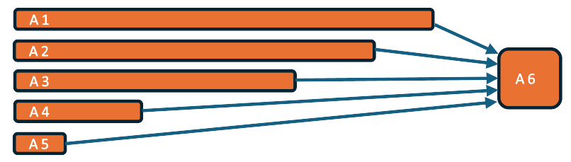
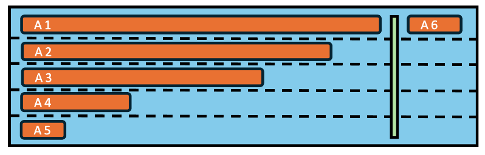
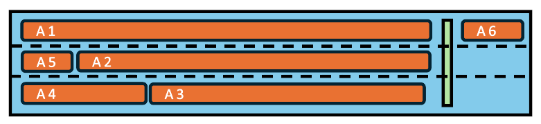
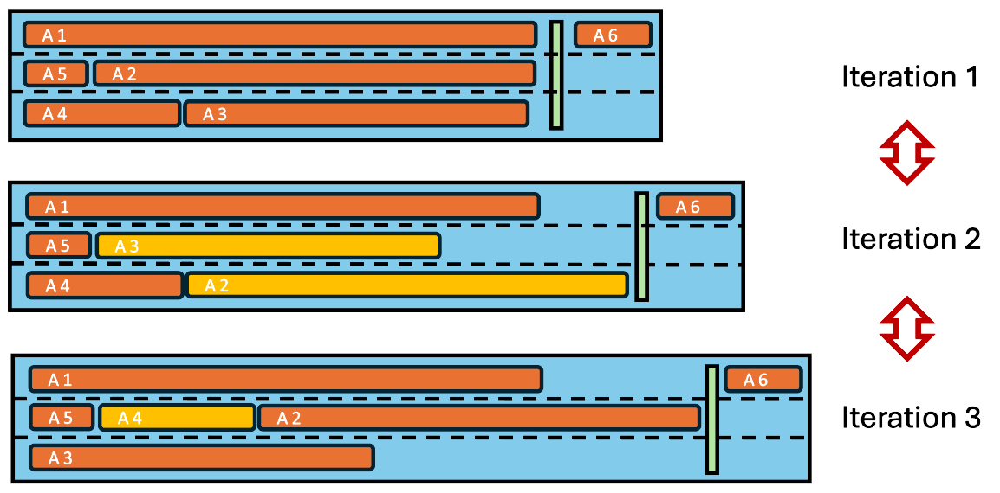

..
   # *******************************************************************************
   # Copyright (c) 2025 Contributors to the Eclipse Foundation
   #
   # See the NOTICE file(s) distributed with this work for additional
   # information regarding copyright ownership.
   #
   # This program and the accompanying materials are made available under the
   # terms of the Apache License Version 2.0 which is available at
   # https://www.apache.org/licenses/LICENSE-2.0
   #
   # SPDX-License-Identifier: Apache-2.0
   # *******************************************************************************

Fixed execution order framework (FEO)
#####################################

.. document:: Fixed execution order framework
   :id: doc__frameworks_feo
   :status: valid
   :security: NO
   :safety: ASIL_B
   :tags: feature_request, frameworks_feo
   :realizes: wp__feat_request

.. toctree::
   :hidden:

   requirements/feature_req.rst
   requirements/aou_req.rst
   requirements/chklst_req_inspection.rst
   architecture/feature_architecture
   architecture/chklst_arch_inspection.rst
   safety_planning/index.rst
   safety_analysis/feature_fmea.rst
   safety_analysis/feature_dfa.rst
   safety_analysis/chklst_safety_analysis_inspection.rst

Feature flag
============

To activate this feature, use the following feature flag:

`experimental_feo`

Abstract
========

This contribution request describes the fixed execution order and reprocessing
framework (FEO), which is intended to support data-driven or time-driven
applications. It provides a fixed execution order for activities and the
necessary infrastructure to reprocess activities in a simulated environment.

Motivation
==========

There are several automotive use-cases that require a fixed and deterministic computation of tasks.
This is particularly crucial for safety-critical applications where the execution order
of tasks is essential for the correct operation of the system. The FEO framework is designed
for applications supporting data-driven and time-driven applications
mainly in the ADAS domain, ensuring a fixed execution order and supporting reprocessing.
(See also :need:`stkh_req__app_architectures__support_data`, :
need:`stkh_req__app_architectures__support_time`, `stkh_req__dev_experience__reprocessing`)

Key aspects of S-CORE and FEO framework are:

* a framework for applications (not for platform services)
* for data-driven and time-driven applications (mainly in the ADAS domain)
* support fixed execution order
* supporting reprocessing

In the following we will explain and argue how and with which major components
these aspects can be implemented.

Applications
============

* The framework is used to build applications
* Multiple applications based on
  the framework can run in parallel on the same host machine
* Applications based on the framework can run in parallel with other
  applications not based on the framework
* The framework does not support
  communication between different applications (except via service activities,
  see below)

Activities
==========

* Applications consist of activities
* Activities are a means to structure applications into building blocks
* Activities have init(), step() and shutdown() entry points
* The framework provides the following APIs to the activities running on it:

  - Read time (feo::time)
  - Communicate to other activities (feo::com)
  - Log (feo::log)
  - Configuration parameters (feo::param)
  - Persistency (feo::pers)
  - Tracing (feo::tracing)

* There are two types of activities:

  - Application activities
  - Service activities

Application Activities
======================

* Application activities must only use APIs provided by the framework as defined above
* Application activities are single threaded, they can not run outside of their entry points,
  they must not spawn other threads or process
* Activities can be implemented in C++ or Rust, mixed systems with both
  C++ and Rust activities shall be supported.

Service Activities
==================

* Service activities are a means to interact with the outside world, e.g. via
  network communication, direct sensor input or direct actuator output
* Service activities may also use APIs external to the framework
  (e.g. networking APIs, reading from external sensor devices, writing HW I/O, etc.)
* Service activities run at the beginning ("input service activity") and at the end
  ("output service activity") of a task chain (see below)
* Input service activities provide the input values to the application activities
  within the task chain, by means of communication
* All input service activities must finish execution before the first application activity
  is run. This can be achieved by proper setup of the chain dependencies (see below)
* There must be at least one input service activity
* Output service activities consume output values from the application activities
  calculated within the task chain an provide them to the outside world
* All output service activities must run after all application service activities have
  finished execution. This is achieved by proper setup of the chain dependencies (see below)
* There must be at least one output service activity

Communication
=============

* Application type activities can only communicate to other activities within
  the same application and using the provided communication API
* Communication consists of sending and receiving messages on named topics
* The receiver of a message on a topic does not know the sender, instead it only
  relies on the message itself independent of the source of the message
* There can only be one sender per topic but multiple receivers
* Optional: there can be multiple senders per topic
* There is no publish/subscribe mechanism accessible to activities, instead
  the set of known communication topics and the assignment of which activity
  sends and receives to/from which topic is "runtime static"
* "runtime static" means "static after the startup phase", i.e. during startup, the
  framework can configure or build up communication connections, but as soon as the
  run phase starts (where the activities' step() functions are called), the connections
  are fixed and will not change any more.
* Communication relations are typically configured in configuration files
* Messages/topics are statically typed
* Only messages of the matching type can be sent/received on a specific topic
* The binary representation of messages is defined by the framework in order
  to support communication between activities implemented in different
  languages (C++/Rust)
* Message types may be primitive types or complex (nested) types
* Complex types can be built by using structs and arrays of types
* Sending a message by an activity involves the following steps:

  - Call API to acquire a handle to a message buffer for a certain topic
  - Fill data into the provided memory buffer
  - Call API to send the message

* Reception of a message by an activity involves the following steps:

  - Use API to receive message from a certain topic, this returns a handle to a data buffer
  - Read message data from data buffer

* The receiver can not modify the message, the framework will enforce this,
  for example by using read-only types or by configuring memory protect of the OS

Queuing of topics:

* Queuing can be enabled per topic, a queue of length N means that the last N messages are
  kept for a specific topic
* Receivers have access to the last N elements, reading an element from the
  queue by a receiver doesn't change the queue, i.e. doesn't remove it from the queue.
  instead all receiver will always see the last N elements
* Optional: a queue pointer to the element last read is maintained per receiver.
  However, the queue with its buffers still only exists once per topic. If one receiver
  receives an element from the queue, its queue pointer is incremented so that next
  time it reads the next element, this does not affect the queue pointers of other receivers
* Queue enable and queue length are "runtime static" configuration settings

Process/Thread/Activity Mapping
===============================

* An application consists of one or more processes
* One of the processes is the primary process
* If there is more than one process, the other processes are secondary processes
* There can be one or more threads per process
* The number of processes and threads is statically defined and
  does not change once the application has been started (runtime static)
* Activities are statically mapped to threads within processes within the application
* There can be multiple activities mapped to the same thread

* There is one executable per process, so an application may consist of multiple executables
* Each executable contains part of this framework as well as the activities mapped to the
  corresponding process
* It is assumed that an external entity starts all the executables belonging to the
  same application. The reason for this is, that for security reasons, only very
  specific entities should have the ability to create processes
* The executables belonging to an application are grouped (e.g. in the filesystem) so that
  it's clear that they belong together
* One reason for having multiple processes per application is to
  achieve Freedom From Interference for safety relevant applications

Static mapping of activities to threads
'''''''''''''''''''''''''''''''''''''''

As pointed out above, FEO activities are required to be mapped to threads in a static way.
The rationale behind this requirement is:

* Calling activity functions init(), step() and shutdown() from a single pre-defined thread
  allows implementations to make use of thread-local optimizations such as thread-local variables.
* Calling an activity's step() function from different threads in different iterations of the
  task chain may cause execution time jitter e.g. from unpredictable cache misses or different
  properties of the processor cores the respective threads may be assigned to.
* Most importantly, a dynamic assignment of activities to threads may result in non-deterministic
  variations of the task-chain execution time.

To understand how a dynamic thread assignment can cause execution time variations, consider
the following example (sub-) task chain.

|example_task_chain|

Here, activity 6 depends on, i.e. must be executed after activities 1 to 5. The length of the bars
is intended to indicate the relative computation time needed by the respective activity on a
single processor core. It is assumed that all of these activities will be executed in the same process.

In a simple approach, each of the activities 1 to 5 could be assigned to its own thread and
activity 6 could be executed subsequently in one of these threads as shown in the figure below.
Each blue "lane" indicates one thread.

|example_task_chain_5_threads|

If each thread runs on a separate core and execution is not interrupted by other tasks, the length of
the blue box is related to the total execution time of the task chain.

Approximately the same total execution time can be achieved with only 3 threads (on three cores), if the
tasks are assigned in an optimized way:

|example_task_chain_3_threads_optimized|

If, on the other hand,  activities are assigned to the same 3 threads in a dynamic way, the execution
time may vary unpredictably, because of the possibly varying execution sequence of activities,
as can be seen below.

|example_task_chain_3_threads_dynamic|

Lifecycle
=========

* The lifecycle of an application consists of 3 phases:

  - startup phase
  - run phase
  - shutdown phase

* During startup phase, the primary process connects with the secondary processes
  (if present), in order to:

  - Build up connections for communication (e.g. find shared memory segments
    provided/consumed)
  - Connect to the parameter service
  - Coordinate the init and later the shutdown process
  - Coordinate the execution of the task chain (see below)

* During the shutdown phase, the primary process coordinates the shutdown of
  all secondary processes
* The connection between primary and secondary processes is kept up as long as the
  application is running
* If the connection breaks down unexpectedly while the application is running,
  the involved processes terminate (either by a command from the primary process
  or by detecting connection loss to the primary process)

Activity Init:

* At the end of the startup phase, the framework will invoke the init() entry point
  of each activity
* The init() method will run in the thread assigned to the activity.
* The order in which init() is called for different activities is arbitrary, it may happen in parallel or sequentially.

Activity Shutdown:

* At the beginning of the shutdown phase, the framework will invoke the shutdown()
  entry point of each application
* The shutdown() method will run in the thread assigned to the activity.
* The order of invoking the shutdown() entry points across activities is not defined,
  invocation may happen in parallel or sequentially

Scheduling
==========

* Activities are arranged in a task chain
* There is exactly one task chain per application
* The task chain describes the execution order of the activities in the run phase
* Task chains run cyclically, e.g. every 30ms
* Optional: task chains can be triggered on event
* All activities are executed once per task chain run
* All activities finish within a single task chain run
* Running an activity means that the framework is calling its step() function
  within the process/thread it has been mapped to
* The execution order is defined by a dependency model:

  - Each activity can depend on N other activities in the same task chain
  - An activity's step() function gets called as soon as the step()
    functions of the activities it depends on have been called

* The framework takes care to run the activities in this order,
  independent of the thread/process the activity is mapped to
* While the order is guaranteed, there is no guarantee that an activity is
  run immediately after all its dependencies have finished.
  For example if two activities mapped to the same thread are ready to run
  at the same time, they can still only run one after the other
* Note however, that for a particular (static) setup of threads, processes
  and activity mapping, the invocation delay is deterministic
  (apart from differences in the activity execution times)
* The execution order and timing of an activity are independent of any communication that activity may perform.
* The dependencies should be defined by the application developer in a way so that
  processing results passed via communication are available when they are needed
  (if an activity needs an output of another activity it sets that other
  activity as its dependency and therefore will only run once the other one
  is finished and therefore has produced the results the first one needs)

Executor and Agents
===================

* The coordinating entity in the primary process is the "executor"
* The executor coordinates the invocation of the activities in the
  order as described above
* As a central entity, the executor is able to trace and monitor the
  system behavior as sequence of activity invocations (see below)
* The actual activity invocation is done by an "agent"
* The agent exists in each process belonging to an application
* The agent connects to the executor during the startup phase
* The agent takes invocation commands sent by the executor and
  executes them in its local process on behalf of the executor

Tracing
=======

* The framework can make use of the tracing API (feo::tracing) to trace
  the program flow, mainly for debugging purposes.
* The tracing events generated by the tracing API can be recorded for later
  inspection e.g. using a UI like Google Perfetto or Eclipse TraceCompass.

Performance
===========

The framework is designed to ensure deterministic execution order and
timing of activities, supporting safety-critical applications
in the automotive domain. In this domain the footprint of the framework is crucial especially
w.r.t impact of computation load and latency.

Error Handling
==============

Possible error cases during the different FEO life cycle states shall be handled as follows. For now, the
descriptions are focussed on the intended implementation for S-CORE v0.5. Potential adaptations for
S-CORE v1.0 have been noted down in the next Section.

* Independent of state
    - If the primary process dies, the external lifecycle management shall kill all dependent processes.
    - If a secondary process dies, the lifecycle management shall send a termination signal to the primary process.
      The primary process shall call the shutdown function of all remaining activities in arbitrary sequence and
      terminate itself.

* State: Lifecycle Manager creates all processes (primary & secondaries)
    - If not all secondaries connect to the primary in time, the primary will terminate itself.
      The startup functions shall not be triggered.

* State: Lifecycle Manager has created all processes (primary & secondaries), all secondaries have connected to the primary
    - If an error occurs during the execution of a startup function, the primary process shall abort calling startup functions
          and terminate itself. For all of the activities whose startup functions have already been called successfully,
          the corresponding shutdown functions shall be executed in arbitrary sequence.
    - During initialization (i.e. in the startup function of an activity), activities shall check for resource allocation
      and report an error to the executor in case of failure.
    - If a timeout occurs during startup, stepping or shutdown of an activity, the primary process shall shutdown
      all successfully started activities in arbitrary sequence and terminate itself.
    - If not all activities reach their initialized state within a certain period of time (startup timeout),
      the primary process shall shutdown all successfully started activities in arbitrary sequence and terminate itself.

* State: Lifecycle Manager has created all processes  (primary & secondaries), all secondaries have connected to the primary, all activities have been started up successfully
    - If an activity fails in the step function, the primary process shall call shutdown for all activities in
      arbitrary sequence and terminate itself.
    - If activities do not meet their intermediate (time/memory/cpu-) budgets the issue shall be detected and handled
      outside of FEO. (Resource supervision and quotas will be defined in a separate feature request, if needed.)

* State: Shutdown of activities
    - If an activity fails in the shutdown function, the primary process shall shutdown all remaining activities
      and terminate itself.

Extended features for S-CORE v1.0
=================================

The following features will not be implemented as part of S-CORE v0.5, but have been noted down as potential extensions
for v1.0. They shall be considered as drafts only.

External state
''''''''''''''

* Depending on the reprocessing scenario (see below) it might be necessary
  to put the activities into a well defined state. This can either be done
  by providing all the input to the activities which they need to get
  into that state (which could involve many task chain invocations).
  Another way is to let the framework record activity state just as it
  records communication messages
* External state is a means to make activity state recordable
* Using external state, activities don't hold their state in activity local
  variables (like C++ member variables) but in a state storage provided
  by the framework. This way, they "do not remember anything" from the
  last task chain invocation. Instead, on every new task chain invocation,
  they first read in the external state from the framework provided storage,
  then potentially manipulate the state based on their inputs and then
  store it back for the next task chain invocation

Recording
'''''''''

* As a central entity, the executor is able to record the system behavior as sequence
  of activity invocations.
* The framework can record all messages going over its communication topics
* For each message the recording includes:

  - topic
  - data
  - timestamp
  - sender [optional]

* The framework can record certain execution events:

  - task chain start/end
  - init/step/shutdown() entry point enter per activity
  - init/step/shutdown() entry point leave per activity

* For each event the recording includes:

  - type (e.g. step_enter)
  - context (e.g. activity name of step() entered)
  - timestamp

Reprocessing
''''''''''''

* There are multiple possible reprocessing scenarios, for example:

  - replay of one or many executions of a task chain
  - replay of one or many executions of a single activity

* In a replay scenario, the framework is used to reproduce the communication messages
  and other API behavior (e.g. time, parameters, persistency) as was
  recorded in a previous run
* In case a whole task chain is reprocessed, the outputs of the input service activities
  will be reproduced
* In case only a single activity is reprocessed, the outputs of the predecessors
  in the task chain will be reproduced
* Outputs of application activities are typically not replayed but
  freshly calculated by the activities running during the replay
* The framework supports reprocessing by

  - Starting a task chain at the same point in time as recorded
  - Replaying communication data as recorded
  - Providing time via its time API as recorded

Extended Error Handling
'''''''''''''''''''''''

* Independent of state
    - If the primary process dies, the external lifecycle management shall kill all dependent processes.
    - If a secondary process dies, the lifecycle management shall send a termination signal to the primary process.
      The primary process shall call the shutdown function of all remaining activities in arbitrary sequence and
      terminate itself.

* State: Lifecycle Manager creates all processes (primary & secondaries)
    - If not all secondaries connect to the primary in time, the primary will not terminate, but report an error to the
      lifecycle/health management. The startup functions shall not be triggered.

* State: Lifecycle Manager has created all processes (primary & secondaries), all secondaries have connected to the primary
    - If an error occurs during the execution of a startup function, the primary process shall abort calling startup
      functions and terminate itself. For all of the activities whose startup functions have already been called successfully,
      the corresponding shutdown functions shall be executed in arbitrary sequence.
      In addition, the primary process shall report the issue to health management.
    - During initialization (i.e. in the startup function of an activity), activities shall check for resource allocation
      and report an error to the executor in case of failure.
    - If a timeout occurs during startup, stepping or shutdown of an activity, the primary process shall shutdown all
      successfully started activities in arbitrary sequence and terminate itself.
      In addition, the primary process shall report the issue to health management.
    - If not all activities reach their initialized state within a certain period of time (startup timeout), the
      primary process shall shutdown all successfully started activities in arbitrary sequence and terminate itself.
      In addition, the primary process shall report the issue to health management.

* State: Lifecycle Manager has created all processes  (primary & secondaries), all secondaries have connected to the primary, all activities have been started up successfully
    - If an activity fails in the step function, the primary process shall call shutdown for all activities in
      arbitrary sequence and terminate itself.
      In addition, a logical waypoint error shall be reported to health management.
    - If activities do not meet their intermediate (time/memory/cpu-) budgets the issue shall be detected and handled
      outside of FEO. (Resource supervision and quotas will be defined in a separate feature request, if needed.)

* State: Shutdown of activities
    - If an activity fails in the shutdown function, the primary process shall shutdown all remaining activities and
      terminate itself.
      In addition, a logical waypoint error shall be reported to health management.
