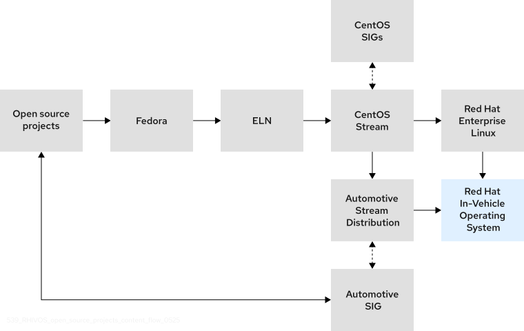

..
   # *******************************************************************************
   # Copyright (c) 2025 Contributors to the Eclipse Foundation
   #
   # See the NOTICE file(s) distributed with this work for additional
   # information regarding copyright ownership.
   #
   # This program and the accompanying materials are made available under the
   # terms of the Apache License Version 2.0 which is available at
   # https://www.apache.org/licenses/LICENSE-2.0
   #
   # SPDX-License-Identifier: Apache-2.0
   # *******************************************************************************

AutoSD
######

Abstract
--------
AutoSD is the upstream binary distribution that serves as the public, in-development preview and functional precursor
of the Red Hat In-Vehicle Operating System (OS).

AutoSD is downstream of CentOS Stream, so it retains most of the CentOS Stream code with a few divergences,
such as an optimized automotive-specific kernel rather than CentOS Stream’s kernel package.
Red Hat In-Vehicle OS is based on both AutoSD and RHEL, both of which are downstreams of CentOS Stream.

Motivation
----------

AutoSD allows the S-CORE stack to be built and tested in a very similar architecture that would be used by
the Red Hat In-Vehicle Operating System (OS).

This section is split into sub-sections to highlight AutoSD's main features.

Declarative Workloads
^^^^^^^^^^^^^^^^^^^^^^

AutoSD uses Quadlet, podman-systemd.unit, a tool that extends Systemd unit files to define linux container workloads
managed by podman and orchestrated by Systemd.

System level files can be deployed at /etc/containers/systemd.

Quadlet parse those files when the OS is booting or when a "systemd daemon-reload" is triggered,
generated files are located at "/run/systemd/generator/".

An sample .container file usually looks like this:

.. code-block:: 
    :caption: /etc/containers/systemd/mysleep.container

    [Unit]
    Description=The sleep container
    After=local-fs.target
    
    [System]
    Restart=always
    
    [Container]
    Image=registry.access.redhat.com/ubi9-minimal:latest
    Exec=sleep 1000
    
    [Install]
    # Start by default on boot
    WantedBy=multi-user.target default.target

Quadlet also supports the usage of Kubernetes YAML files, allowing the same workload definition to be used
by a kubernetes cluster and Podman:

.. code-block:: 
    :caption: /etc/containers/systemd/mysleep.kube

    [Unit]
    Description=The sleep container
    After=local-fs.target

    [System]
    Restart=always

    [kube]
    yaml=sleep.yml
    
    [Install]
    # Start by default on boot
    WantedBy=multi-user.target default.target
 

.. code-block:: 
    :caption: /etc/containers/systemd/mysleep.yml

    apiVersion: v1
    kind: Pod
    metadata:
        name: sleep-pod
    spec:
        containers:
            - name: sleep-container
              image: registry.access.redhat.com/ubi9-minimal:latest
              command: ["sleep", "1000"] 

Mixed Critical Orchestration
^^^^^^^^^^^^^^^^^^^^^^^^^^^^

AutoSD ships a mixed critical orchestration stack with Systemd, Podman, Eclipse BlueChi and QM (containerized environment for QM workloads), which is tightly coupled to the operating system.

Its QM environment is mounted from its own partition and run as a linux container using podman from its own sysroot path:

.. image:: _assets/qm.png
    :width: 600
    :alt: autosd upstream and downstream relationship
    :align: center

Eclipse BlueChi enables mixed critical orchestration between QM and non QM workloads with Systemd:

.. image:: _assets/bluechi.png
    :width: 600
    :alt: autosd upstream and downstream relationship
    :align: center 

Eclipse BlueChi can also work with other orchestrators, be it on-board or off-board, by relying on "state managers",
which can interact with Eclipse BlueChi through its DBUS API to manage workload lifecycles.

More details about Eclipse BlueChi and QM can be found at:

* https://bluechi.readthedocs.io/en/latest/
* https://qm.readthedocs.io/en/latest/
 
Supported Architectures and Platforms
^^^^^^^^^^^^^^^^^^^^^^^^^^^^^^^^^^^^^

AutoSD images are constantly built and tested against both x86_64 and aarch64 architectures through the Automotive SIG pipelines. It’s also built/tested against the following platforms:

* Texas Instruments:

  * BeaglePlay (beagleplay)
  * SK-AM62x Sitara (am62sk)
  * SK-AM69 Jacinto (am69sk)
  * TDA4 EVM (tda4vm_sk)
  * J784S4 EVM (j784s4evm)

* Renesas R-Car S4
* NXP S32G-RDB3
* Qualcomm Snapdragon Ride SX 4.0
* Raspberry pi 4

The following "virtual platforms" are also supported:

* QEMU
* AWS
* Azure

Further details at https://sigs.centos.org/automotive/provisioning/.

Testing Tools
^^^^^^^^^^^^^

AutoSD contains a collection of tools for Perf & Scale tests that can be used to test its S-CORE image: https://sigs.centos.org/automotive/performance_monitoring_with_pcp/#arcaflow-workflow.

Rationale
---------

The proposal is to maintain a repository with manifest AutoSD files to build an image tailored for the S-CORE project, the repository is currently maintained within the CentOS Automotive SIG organization in Gitlab: https://gitlab.com/CentOS/automotive/autosd-image-score, but it could be moved to the S-CORE Github organization as well.

To run Eclipse S-CORE modules and related components in AutoSD, these need to be packaged, in either linux containers images or RPMs.

Packaging would happen at the module level, meaning that:

* A container image for a given module would contain all its components;
* A RPM for a given module would ship all its components as sub-packages.

The CentOS Automotive SIG can build and host either format.

There is also the option to test the S-CORE task in some of AutoSD’s supported hardware, if there is interest (needs further discussion on what and how to test).

Specification
-------------

Possible impacted areas of the specification:

* Operating System and related components
* Mixed Critical Orchestration
* IPC

Backwards Compatibility
-----------------------

   .. note::
      Not needed since it’s a new development platform to be included.

Security Impact
---------------

   .. note::
      The platform can help on some security tests,
      since it uses several SELinux policies (these can be provided if needed).

Safety Impact
-------------

   .. note::
      No impact since it’s a development platform.

License Impact
--------------

   .. note::
      No impact, image manifest files can be licensed under Apache 2.0.
