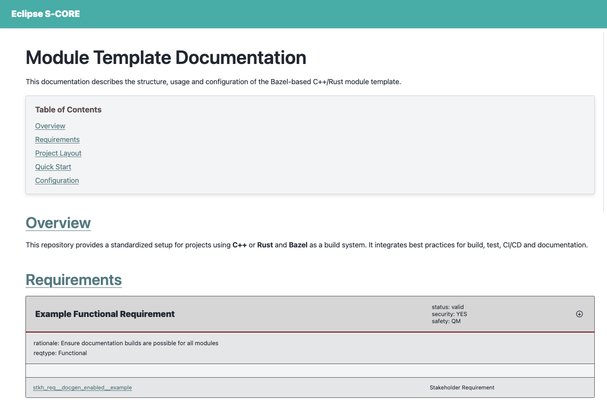

..
   # *******************************************************************************
   # Copyright (c) 2024 Contributors to the Eclipse Foundation
   #
   # See the NOTICE file(s) distributed with this work for additional
   # information regarding copyright ownership.
   #
   # This program and the accompanying materials are made available under the
   # terms of the Apache License Version 2.0 which is available at
   # https://www.apache.org/licenses/LICENSE-2.0
   #
   # SPDX-License-Identifier: Apache-2.0
   # *******************************************************************************

Documentation generation
==========================

.. toctree::
   :maxdepth: 1
   :glob:

Introduction
---------------
As described in the :ref:`Overview of technologies <technology_overview>` chapter,
Eclipse S-CORE uses the sphinx and sphinx-needs toolchain to generate documentation from rst files.
Elements of Eclipse S-CORE metamodel are represented as sphinx-needs objects.

The integration of sphinx, sphinx-needs, and the Eclipse S-CORE-specific extensions is implemented in the repository: 

- https://github.com/eclipse-score/docs-as-code/tree/main/docs  

The following `documentation <https://eclipse-score.github.io/docs-as-code/main/how-to/index.html>`_
provides a description of how the documentation can be created and built. Here, we will focus on a simple example.

Defining a Bazel Documentation Target
-----------------------------------------
To generate HTML documentation from *.rst* files, S-CORE provides a dedicated Bazel rule.
In the top-level `BUILD <https://github.com/eclipse-score/scrample/blob/main/BUILD>`_ file of your module, you should already find:

.. code-block:: python
    :linenos:

    docs(
        source_dir = "docs",
    )

The bazel rule docs needs source_dir as an input parameter. This directory will be given to the *sphinx/sphinx-needs* toolchain,
which will use this directory as source directory and will generate the html documentation based on the files located in the
source directory. Sphinx toolchain will not rely here on any bazel dependencies,
but will use its own mechanism to decide which files should be included for documentation generation.
This is well described in `toctree <https://www.sphinx-doc.org/en/master/usage/restructuredtext/directives.html#directive-toctree>`_
chapter of its documentation.

Sphinx configuration
-----------------------
Two files are essential for documentation generation:

- `docs/conf.py <https://github.com/eclipse-score/scrample/blob/main/docs/conf.py>`_ provides configuration for the *sphinx-toolchain*.
  
  .. code-block:: python
    :linenos:
    :emphasize-lines: 3

    project = "Module Template Project"
    project_url = "https://eclipse-score.github.io/module_template/"
    project_prefix = "SCRAMPLE_"
    author = "Eclipse S-CORE"
    version = "0.1"

    # -- General configuration ---------------------------------------------------
    # https://www.sphinx-doc.org/en/master/usage/configuration.html#general-configuration

    extensions = [
        "sphinx_design",
        "sphinx_needs",
        "sphinxcontrib.plantuml",
        "score_plantuml",
        "score_metamodel",
        "score_draw_uml_funcs",
        "score_source_code_linker",
        "score_layout",
    ]

  Notes:
  
  - project_prefix (e.g., *“SCRAMPLE_”*) is important.
    Other modules will use this prefix when referencing sphinx-needs elements from your module.
  - S-CORE extensions (score_*) are automatically provided via *score_docs_as_code*.

- `index.rst <https://github.com/eclipse-score/scrample/blob/main/docs/index.rst>`_
  is the main entry point for your documentation. It includes all other .rst files, that should be part of the documentation build. 

Building documentation
-----------------------
Run the following command to validate the documentation setup:

.. code-block:: python
  :emphasize-lines: 1

  % bazel build //:docs

The first execution running the bazel command may take longer, because bazel needs to download toolchains and dependencies.
Subsequent runs will be much faster. The command we’ve called will check the consistency of your documentation for errors,
but will not generate any html files. To do so, run following command

.. code-block:: python
  :emphasize-lines: 1, 38

  % bazel run //:docs
  Running Sphinx v8.2.3
  loading translations [en]... done
  DEBUG: Found 0 need references in 0.00 seconds
  calculate directory_hash = e3b0c44298fc1c149afbf4c8996fb92427ae41e4649b934ca495991b7852b855 within 0.00019431114196777344 seconds.
  loading pickled environment... The configuration has changed (7 options: 'html_permalinks_icon', 'html_static_path', 'needs_layouts', 'needs_types', 'plantuml', ...)
  done
  building [mo]: targets for 0 po files that are out of date
  writing output... 
  building [html]: build_info mismatch, copying .buildinfo to .buildinfo.bak
  building [html]: targets for 1 source files that are out of date
  updating environment: [config changed ('skip_rescanning_via_source_code_linker')] 1 added, 0 changed, 0 removed
  reading sources... [100%] index
  Copying static files for sphinx-data-viewer support
  Copying static files for sphinx-needs datatables support
  Copying static style files for sphinx-needs
  looking for now-outdated files... none found
  pickling environment... done
  checking consistency... done
  preparing documents... done
  copying assets... 
  copying static files... 
  Writing evaluated template result to /home/_dev/scrample/_build/_static/basic.css
  Writing evaluated template result to /home/_dev/scrample/_build/_static/language_data.js
  Writing evaluated template result to /home/_dev/scrample/_build/_static/documentation_options.js
  copying static files: done
  copying extra files... 
  copying extra files: done
  copying assets: done

  generating indices... genindex done
  writing additional pages... search done
  dumping search index in English (code: en)... done
  dumping object inventory... done
  Needs successfully exported
  build succeeded.

  The HTML pages are in ../../../../../../../../../../../_dev/scrample/_build.

After a successful build, the html files can be copied somewhere and opened in a web browser.

When working on the documentation, it is helpful to see the current status directly in the web browser.
One option is to use the *live preview* feature. The corresponding bazel target is automatically imported
when you import *doc bazel rule* into your BUILD file.

.. code-block:: python
  
  load("@score_docs_as_code//:docs.bzl", "docs")

Run the following command:

.. code-block:: python
  :emphasize-lines: 1, 9

  % bazel run //:live_preview

  ...

  Needs successfully exported
  build succeeded.

  The HTML pages are in ../../../../../../../../../../../_dev/playground_2/scrample/_build.
  [sphinx-autobuild] Serving on http://127.0.0.1:8000
  [sphinx-autobuild] Waiting to detect changes...
 
As you can see, a local server is started on following port and address: http://127.0.0.1:8000 .
Open it in your web browser and you should be able to view the current version of the documentation.

The live preview: 

- rebuilds automatically
- updates on every file change 
- stays active until you stop the bazel process (Ctrl+C).

Now you can replace the placeholder content in index.rst with meaningful text, as shown in the following
`commit <https://github.com/eclipse-score/scrample/commit/5179175823ecda51775e459ad73d7230cd4c880a>`_.

