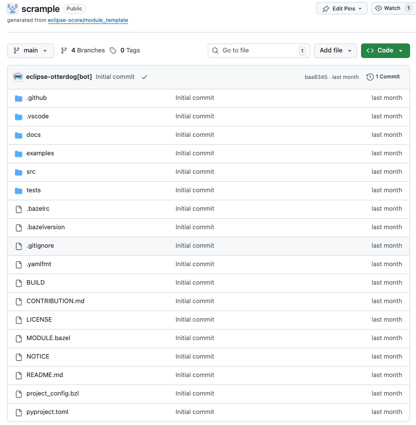

..
   # *******************************************************************************
   # Copyright (c) 2024 Contributors to the Eclipse Foundation
   #
   # See the NOTICE file(s) distributed with this work for additional
   # information regarding copyright ownership.
   #
   # This program and the accompanying materials are made available under the
   # terms of the Apache License Version 2.0 which is available at
   # https://www.apache.org/licenses/LICENSE-2.0
   #
   # SPDX-License-Identifier: Apache-2.0
   # *******************************************************************************

First Eclipse S-CORE Module
=================================

.. toctree::
   :maxdepth: 1
   :glob:

Before starting, ensure you are an official contributor to the Eclipse S-CORE project.
Otherwise, you will not have required permissions. Instructions can be found in 
`Actions to ensure Proper Contribution Attribution in Eclipse Eclipse S-CORE <https://eclipse-score.github.io/score/main/contribute/general/contribution_attribution.html#>`_.

Once you have created an Eclipse account,
accepted Eclipse Contributor Agreement (ECA), and linked your GitHub account with your Eclipse Account,
contact one of the Eclipse S-CORE Project Leads (listed at the official `Eclipse SDV S-Core webpage <https://projects.eclipse.org/projects/automotive.score/who>`_).
They will add you to the list of the official contributors of the Eclipse S-CORE GitHub organization. 

The recommended communication channel to approach Eclipse S-CORE project leads is the 
`eclipse sdv slack channel <https://sdv.eclipse.org/get-engaged/>`_.
 

Creating a Repository for Your Module
------------------------------------------
After becoming part of Eclipse S-CORE GitHub organization, you can create a repository for your module.
Repository creation follows Eclipse organizational rules.
Most configuration is handled via `otterdog configuration <https://otterdog.readthedocs.io/en/latest/>`_ located in: 

- https://github.com/eclipse-score/.eclipsefdn. 

Create a private fork of this repository and modify the file: 

- `otterdog/eclipse-score.jsonnet <https://github.com/eclipse-score/.eclipsefdn/blob/main/otterdog/eclipse-score.jsonnet>`_ 

Add your repository definition, e.g.: 

.. code-block:: python
    :emphasize-lines: 4, 5, 6

    newModuleRepo('logging') {
        description: "Repository for logging framework",
    },
    newModuleRepo('scrample') {
        description: "Repository for example component",
    },  
    newModuleRepo('inc_abi_compatible_datatypes') {
        description: "Incubation repository for ABI compatible data types feature",
    },

Then, create a PR in the original https://github.com/eclipse-score/.eclipsefdn repository. The PR must be approved by:

- Eclipse S-CORE project lead
- Eclipse Foundation Security Team

.. tip::
    
    To speed up approval, mention both groups in your PR comment:    
    
    .. code-block:: python
        
        @eclipse-score/automotive-score-project-leads
        @eclipse-score/eclipsefdn-security

        Please approve.

Repository Layout
^^^^^^^^^^^^^^^^^^
Once merged, your new repository will appear in the Eclipse S-CORE GitHub organization repositories overview.

All repositories are created using the `Eclipse S-CORE repository template <https://github.com/eclipse-score/module_template>`:

- <https://github.com/eclipse-score/module_template>. 

The `README.md <https://github.com/eclipse-score/module_template/blob/main/README.md>`_ file already explains the basic structure.
Below is an overview of the most relevant files and folders.

.github/workflows/
------------------
Contains CI/CD workflows (build, unit-tests, 
:ref:`integration gate <integration_process>` checks).

.vscode
------------------
Provides Eclipse S-CORE recommended VS Code setup, including code completion patterns for requirements and architecture in 
`.vscode/restructuredtext.code-snippets <https://github.com/eclipse-score/module_template/blob/main/.vscode/restructuredtext.code-snippets>`_.

docs
-----
Place all module documentation here in `rst format <https://www.sphinx-doc.org/en/master/usage/restructuredtext/index.html>`_.
Examples follow later in this guide.

.. tip::
    We try to describe most `common workflows <https://eclipse-score.github.io/score/main/contribute/contribution_request/index.html#doc__contr_guideline>`_ 
    for developers. It is worth checking it.

src
-----
Self-explainatory: source code

test
-----
Self-explainatory: tests

.bazelrc 
--------
Defines bazel configuration for your the module.
Important entries in `.bazelrc <https://github.com/eclipse-score/scrample/blob/main/.bazelrc>`_ file include:

.. code-block:: python
    :linenos:
    :emphasize-lines: 8, 9

    build --java_language_version=17
    build --tool_java_language_version=17
    build --java_runtime_version=remotejdk_17
    build --tool_java_runtime_version=remotejdk_17

    test --test_output=errors

    common --registry=https://raw.githubusercontent.com/eclipse-score/bazel_registry/main/
    common --registry=https://bcr.bazel.build

- Line number 8 points to the Eclipse S-CORE https://github.com/eclipse-score/bazel_registry,
  where all official versions of Eclipse S-CORE modules are published.

- Line number 9 points to the common bazel registry, where common bazel modules are made available for everyone.

This means, once we´re referencing a depending module with our scrample application,
bazel will start searching it in one of these two locations.

MODULE.bazel 
-------------
This file turns your repository into a bazel module. 

Let us check `MODULE.bazel <https://github.com/eclipse-score/scrample/blob/main/MODULE.bazel>`_ initial content:

.. code-block:: python
    :linenos:

    module(
        name = "cpp_rust_template_repository",
        version = "1.0",
    )

Here, we´re making the first declaration of our module by defining a name and a version.
Please be aware, that only after our module was published in the Eclipse S-CORE bazel registry, other modules can access it.

Rename the module and replace *cpp_rust_template_repository* by *score_scrample*.

.. code-block:: python
    :linenos:

    module(
        name = "score_scrample",
        version = "1.0",
    )

Please be aware, according to Eclipse S-CORE´s naming convention all module names must start with *score\_* prefix.
 
.. code-block:: python
    :linenos:

    bazel_dep(name = "rules_python", version = "1.4.1")

    PYTHON_VERSION = "3.12"

    python = use_extension("@rules_python//python/extensions:python.bzl", "python")
    python.toolchain(
        is_default = True,
        python_version = PYTHON_VERSION,
    )
    use_repo(python)

    # Add GoogleTest dependency
    bazel_dep(name = "googletest", version = "1.17.0")

    # Rust rules for Bazel
    bazel_dep(name = "rules_rust", version = "0.63.0")

    # C/C++ rules for Bazel
    bazel_dep(name = "rules_cc", version = "0.2.1")

In the code snippet above, we declare dependencies to modules, that are publicly available in common bazel registry, e.g.
for unit test execution with gtest.

.. code-block:: python
    :linenos:

    # LLVM Toolchains Rules - host configuration
    bazel_dep(name = "toolchains_llvm", version = "1.4.0")

    llvm = use_extension("@toolchains_llvm//toolchain/extensions:llvm.bzl", "llvm")
    llvm.toolchain(
        cxx_standard = {"": "c++17"},
        llvm_version = "19.1.0",
    )
    use_repo(llvm, "llvm_toolchain")
    use_repo(llvm, "llvm_toolchain_llvm")

    register_toolchains("@llvm_toolchain//:all")

Here we add a llvm toolchain and register its usage in our module, so that we can build our source code.
In upcoming chapters, we will talk about this in more detail.    

.. code-block:: python
    :linenos:

    # tooling
    bazel_dep(name = "score_tooling", version = "1.0.1")

    #docs-as-code
    bazel_dep(name = "score_docs_as_code", version = "1.1.0")

Finally, we add a dependency to Eclipse S-CORE native modules “*score_tooling*” and “*score_docs_as_code*”.
These enable documentation builds and tooling checks (e.g., license checker).

.. tip::
    Working across multiple modules and repositories can be challenging. Use the following approach during development:
    
    - use `git_override()  <https://bazel.build/rules/lib/globals/module#git_override>`_ 
      if you want to use a version of another module, that is currently not officially availabe in the bazel registry.

    - use `local_path_override()  <https://bazel.build/rules/lib/globals/module#local_path_override>`_
      if you want to use your local version of the module, e.g. during active development.    

BUILD 
-----
The bazel `BUILD <https://github.com/eclipse-score/scrample/blob/main/BUILD>`_ file
contains main bazel targets on the top level of the scrample project:

.. code-block:: python
    :linenos:

    load("@score_docs_as_code//:docs.bzl", "docs")
    load("@score_tooling//:defs.bzl", "copyright_checker", "dash_license_checker", "setup_starpls", "use_format_targets")
    load("//:project_config.bzl", "PROJECT_CONFIG")

First, we load bazel rules and macros, implemented in Eclipse S-CORE context from the modules,
that we’ve defined as dependencies in the MODULE.bazel file, e.g. https://github.com/eclipse-score/docs-as-code.

.. code-block:: python
    :linenos:

    copyright_checker(
        name = "copyright",
        srcs = [
            "src",
            "tests",
            "//:BUILD",
            "//:MODULE.bazel",
        ],
        config = "@score_tooling//cr_checker/resources:config",
        template = "@score_tooling//cr_checker/resources:templates",
        visibility = ["//visibility:public"],
    )

    dash_license_checker(
        src = "//examples:cargo_lock",
        file_type = "",  # let it auto-detect based on project_config
        project_config = PROJECT_CONFIG,
        visibility = ["//visibility:public"],
    )

Second, we define bazel targets for *copyright_checker* and *dash_license_checker*,
based on bazel rules implemented and imported from https://github.com/eclipse-score/tooling module.

.. code-block:: python
    :linenos:

    docs(
        source_dir = "docs",
    )

Finally, the *docs* target builds all documentation in the .rst format, which is located in the 
`docs <https://github.com/eclipse-score/docs-as-code/tree/main/docs>`_ folder and all its subfolders.
This functionality is implemented in https://github.com/eclipse-score/docs-as-code module.
