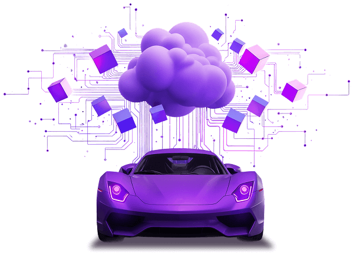

..
   # *******************************************************************************
   # Copyright (c) 2024 Contributors to the Eclipse Foundation
   #
   # See the NOTICE file(s) distributed with this work for additional
   # information regarding copyright ownership.
   #
   # This program and the accompanying materials are made available under the
   # terms of the Apache License Version 2.0 which is available at
   # https://www.apache.org/licenses/LICENSE-2.0
   #
   # SPDX-License-Identifier: Apache-2.0
   # *******************************************************************************

.. toctree::
   :hidden:

   project_basics/index.rst
   own_application/index.rst
   building_simple_application/index.rst

.. document:: Handbook
   :id: doc__platform_handbook
   :status: valid
   :safety: ASIL_B
   :security: YES
   :realizes: wp__platform_handbook

Handbook
========

Introduction
------------

The Eclipse S-CORE project is evolving rapidly. With the launch of our first release, “Eclipse S-CORE 0.5”,
we are providing this tutorial to explain how the project works from a technical perspective.
Because S-CORE follows an iterative, code-centric development model, this description is updated continuously
and may not always reflect the latest state. Contributions from the community are therefore welcome.

Background of Eclipse S-CORE
------------------------------

Before we look at the technical details, it is helpful to understand the origins and goals of Eclipse S-CORE.
The project was founded in September 2024, inspired by the success of open-source developments in other industries in recent decades.
All founding members came from the automotive industry and shared the same vision: a code-first, open-source software platform
for onboard electronic control units (ECUs) would benefit the entire industry and significantly accelerate progress.
With every vehicle generation the volume and complexity of new functions grows.
As a result, the underlying software platform becomes larger, more complex, and more expensive to maintain.
Developing such platforms independently at each automotive company is inefficient and does not improve product quality.
It also consumes significant effort and budget without generating direct customer value.

An open-source approach offers an alternative:
-	to improved quality through shared development,
-	reduced effort across the industry, and
-	faster delivery of new vehicle functions.

In addition, a common open-source software platform creates a shared technical foundation that supports collaboration in future series projects.

Eclipse S-CORE is not the first project to address these challenges.
`AUTOSAR <https://www.autosar.org/>`_ also aimed to standardize software platforms, processes, methods, and tools.
However, Eclipse S-CORE goes beyond by pursuing additional goals:

- **Providing a reference implementation of the software platform:**
  Many issues appear for the very first time when the software stack is integrated. Some aspects
  – such as performance – cannot be sufficiently defined through specifications alone.
  By providing an open-source reference implementation, S-CORE identifies and resolves many of these problems early.
  Using the same implementation across projects prevents known issues from reappearing later.

- **Ensuring quality and a Functional-Safety-compliant development process:**
  High code quality, clear requirements and architecture, and comprehensive test coverage are essential
  for industrial use, especially in systems with Functional Safety relevance.
  S-CORE therefore:

  1. Defines a process aligned with Functional Safety (ISO 26262), and
  2. ensures, that all module implementations follow this process.
     This makes Eclipse S-CORE unique among traditional open-source projects,
     which often focus primarily on code, not on automotive-grade processes.

What Eclipse S-CORE does not provide
^^^^^^^^^^^^^^^^^^^^^^^^^^^^^^^^^^^^^^^
**Eclipse S-CORE** is **not** an **out-of-the-box ready for direct integration into a** series vehicle program.
Key reasons include:

- As an open-source project, **no commercial entity assumes liability** for the provided results.
- All Eclipse S-CORE **artefacts  are generic**,
  designed to serve **as a foundation for multiple commercial distributions** tailored to specific project needs.

The strength of the Eclipse S-CORE project lies in its openness:

the software development process, the tooling, and the automated checks used in CI
are all transparent and open source. Any stakeholder can verify that the platform behaves as intended.
When used as a base in industrial projects, all work products can be reused.
The open-source community also maintains these artefacts over time.
However, the **responsibility for** assurance of **quality (ASPICE), cybersecurity (ISO21434)
and Functional Safety (ISO26262) of the target always system remains with the series project**.
The maintainers of the Eclipse S-CORE project are convinced that more automotive companies will
recognize these benefits, join the project, and apply Eclipse S-CORE in their future series projects.
