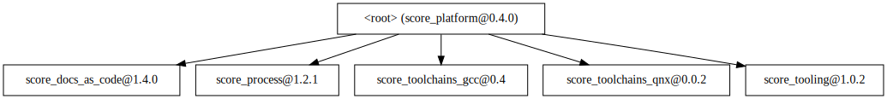
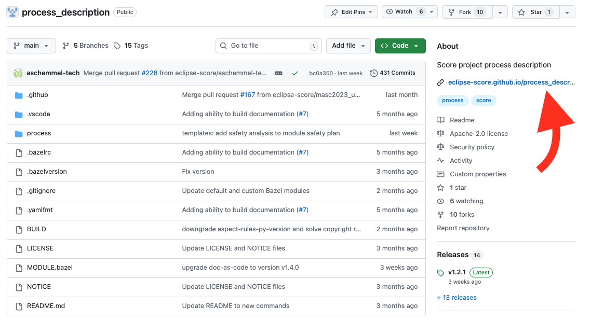
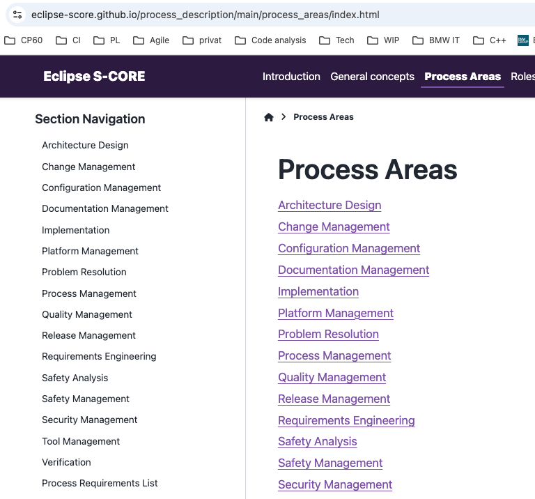

..
   # *******************************************************************************
   # Copyright (c) 2024 Contributors to the Eclipse Foundation
   #
   # See the NOTICE file(s) distributed with this work for additional
   # information regarding copyright ownership.
   #
   # This program and the accompanying materials are made available under the
   # terms of the Apache License Version 2.0 which is available at
   # https://www.apache.org/licenses/LICENSE-2.0
   #
   # SPDX-License-Identifier: Apache-2.0
   # *******************************************************************************

Module Structure Overview
==========================

.. toctree::
   :maxdepth: 1
   :glob:

As described in the :ref:`Technology Overview <technology_overview>` chapter, Eclipse S-CORE consists of multiple bazel modules,
typically stored in separate repositories. Most modules reside in the `Eclipse S-CORE GitHub organization <https://github.com/eclipse-score>`_,
while some originate from other Eclipse projects and are reused here. This chapter introduces
the most important bazel modules and repositories in Eclipse S-CORE GitHub organization.

Eclipse S-CORE Platform
-----------------------
GitHub Link: https://github.com/eclipse-score/score

This is the central repository of the project. It contains:

- stakeholder requirements
- Assumptions of Use (AoUs) for potential users
- the list of platform features
- the high-level architecture
- the decomposition of the architecture into modules
- the definition of logical interfaces and module functionality

Process Description
--------------------
GitHub Link: https://github.com/eclipse-score/process_description

.. hint::
    We automatically generate for every repository html documentation from rst files.
    You can easily open it as shown at the picture below.

The process repository describes the Eclipse S-CORE software development process. It describes:

- the general concepts and principles of the Eclipse S-CORE software development process
- all process areas in detail
- how work products such as requirements and architecture must be specified
- PMP describes, how the processes are deployed within S-CORE `Project Management Plan <https://eclipse-score.github.io/score/main/platform_management_plan/index.html>`_

Doc-as-Code
-----------
GitHub Link: https://github.com/eclipse-score/docs-as-code

Doc-as-code repository provides the tooling around sphinx and sphinx-needs framework, including:

- traceability between requirements, architecture, and tests
- linking process artefacts
- checks that validate the Eclipse S-CORE metamodel, as defined in the process description

The implementation status of tooling requirements is available in the
`Tool Requirements Overview <https://eclipse-score.github.io/docs-as-code/main/requirements/requirements.html>`_.

Tooling
-------
GitHub Link: https://github.com/eclipse-score/tooling

Tooling repository collects all supporting tools for the Eclipse S-CORE project, e.g., format_checkers.

Toolchains and bazel platform
----------------------------------
GitHub Link:

- https://github.com/eclipse-score/toolchains_qnx
- https://github.com/eclipse-score/toolchains_gcc
- https://github.com/eclipse-score/toolchains_rust

These repositories define toolchains (gcc/qnx/rust) including compiler and linker flags
used to build the Eclipse S-CORE software.
The repository called “bazel platforms” defines the platforms supported by Eclipse S-CORE (e.g., x86_64-qnx),
as shown in the following `BUILD  <https://github.com/eclipse-score/bazel_platforms/blob/main/BUILD>`_ file.

Bazel Registry
---------------
GitHub Link: https://github.com/eclipse-score/bazel_registry

Bazel registry is essential for publishing official releases of all Eclipse S-CORE bazel modules.
It enables consistent and reliable module referencing across the entire project.

Software Modules
----------------
GitHub Link (e.g. for baselibs): https://github.com/eclipse-score/baselibs

Each software module is a bazel module stored in its own repository. Software modules typically include:

- component requirements and architecture
- detailed design
- implementation
- unit- and component tests
- documentation

Modules usually depend on other modules in the Eclipse S-CORE GitHub organization, especially on

- https://github.com/eclipse-score module to reference feature requirements and architecture
  in the component requirements and architecture
- https://github.com/eclipse-score/docs-as-code module for sphinx/sphinx-needs framework and tooling around it
- **toolchains** modules for the compiler toolchains.

Reference Integration
----------------------
GitHub Link: https://github.com/eclipse-score/reference_integration

This repository is a key part of the Eclipse S-CORE project.
All Eclipse S-CORE modules are integrated together to ensure, that they match to each other.
It integrates all software modules into reference images (e.g., a qnx x86 image) to verify that:

- all module dependencies are consistent
- modules work correctly together
- feature requirements are fulfilled

Feature integration tests are executed on these reference images to validate the complete platform.
