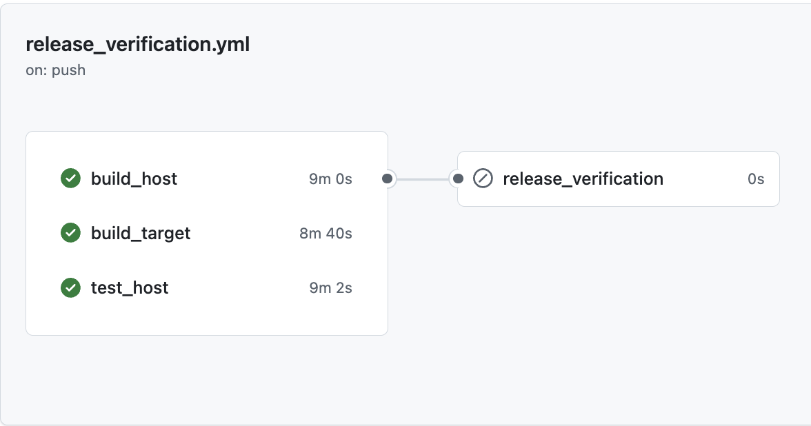

..
   # *******************************************************************************
   # Copyright (c) 2024 Contributors to the Eclipse Foundation
   #
   # See the NOTICE file(s) distributed with this work for additional
   # information regarding copyright ownership.
   #
   # This program and the accompanying materials are made available under the
   # terms of the Apache License Version 2.0 which is available at
   # https://www.apache.org/licenses/LICENSE-2.0
   #
   # SPDX-License-Identifier: Apache-2.0
   # *******************************************************************************

Overview of technologies
===========================

.. toctree::
   :maxdepth: 1
   :glob:

.. _technology_overview:

.. image:: ../_assets/score_tooling.svg
   :alt: Score tooling
   :align: center

Bazel and repo structure
-------------------------

Our open-source commitment goes far beyond code sharing on an open-source platform.
The whole infrastructure and tooling of Eclipse S-CORE is based on open-source,
in order to enable a smooth onboarding and collaboration among members from different backgrounds.
In the next paragraphs, an overview will be given to the main technologies and tools,
followed by deep dives for each and every tool and process step.

The whole Eclipse S-CORE project is built upon the `bazel <https://bazel.build/>`_ build system.
This includes every implemented dependency and almost every automatization.
The only exception is the CI/CD pipeline (s. below). Validation of requirements, generation of documentation,
building of source code, execution of unit, integration tests, etc., for each and every of these process steps,
a bazel target is defined in Eclipse S-CORE. Bazel is a state-of-the-art build system, which allows hermetical and reproducible builds.
These features have a significant importance for building systems in a safety-critical environment.
Additionally, bazel provides the ability to extend its functionality for project related use-cases by using
`bazel macros <https://bazel.build/extending/macros>`_ and `bazel rules <https://bazel.build/extending/rules>`_.

`bazel modules <https://bazel.build/external/module>`_ is another handy feature which is commonly used in Eclipse S-CORE.
Basically, the whole Eclipse S-CORE project consists of multiple repos, whereas every repo implements its own functionality.
The main reason for the modular approach, is to encourage the reuse of already existing implementations.
This is by far easier when every functionality is encapsulated in its own repository compared to a mono repository.
Yet, the modular approach also has some challenges. One of them is the impact on organization.
For every module there is a separate team, and with the number of teams the organizational challenges increase as well.
Please have a look on the  `project management plan <https://eclipse-score.github.io/score/main/platform_management_plan/project_management.html>`_
for more details regarding S-CORE´s organizational structure.
Another challenge comes with the technical integration and dependency management of existing modules and components.
Eclipse S-CORE´s approach for technical integration is described in the :ref:`integration process <integration_process>`.

However, a basic support for handling dependencies among bazel modules is provided by the build system.
For publishing of official modules versions, a mechanism called `bazel registry <https://bazel.build/versions/6.1.0/build/bzlmod#registries>`_
is used.

In a nutshell, you can perceive **Eclipse S-CORE as an integration project**, with **integrated modules** from other projects 
and **new modules**, specifically developed for Eclipse S-CORE. The main responsibility of Eclipse S-CORE (as integration project) is to ensure,
that all modules work seamlessly together. At the end of a day, a platform needs to be established, which can be used as basis for
future safety qualifiable products.

CI/CD pipeline
---------------
There is not much say here since our CI/CD pipeline is built as every state-of-the art project today.
We strongly rely on the GitHub infrastructure, e.g., by using `GitHub actions <https://docs.github.com/de/actions>`_
for automatization and implementation of CI/CD check pipeline.

Sphinx/Sphinx-needs and Documentation 
--------------------------------------
**The Sphinx tool and related sphinx-needs technology** are used in S-Core for processes such as **project documentation,
requirement specification, assumptions of use, architecture design, detailed design, testing and other software process
related artifacts**. Additionally, we´ve **extended** the sphinx-needs implementation with checks in order **to ensure traceability
and compliance** to the Eclipse S-CORE metamodel. The Eclipse S-CORE metamodel and -traceability concept are described in the
`process description <https://eclipse-score.github.io/process_description/main/general_concepts/index.html>`_,
and a guidance how to use sphinx/sphinx-needs framework in Eclipse S-CORE can be found in
`docs-as-code how-to documentation <https://eclipse-score.github.io/docs-as-code/main/how-to/index.html>`_ how-to documentation.

Programming languages
------------------------
Depending on the specific use-case, following programming languages are used in Eclipse S-CORE.

**python** is used for any kind of **automation**.

**C++** is mainly used for development of the **target code**.
We assume, in near future C++ will be (at least) **partially replaced by Rust**.
We´re already making the first baby steps by implementing some components in Rust.
However, since the support and acceptance of Rust in automotive series projects has not yet reached a decisive point,
we still mainly rely on C/C++.

Testing
--------
In general, we differentiate between **three levels of testing**: **“unit-testing”**, **“component testing”** and **“feature integration testing”**.
The **Unit-test** framework strongly depends on used programming languages, e.g., in case of C++ we rely on **“gtest/gmock”**.
Detailed description of our framework for **component testing** can be found in the `testing tools repo <https://github.com/eclipse-score/testing_tools>`_.
For **feature integration testing** we use the framework **“ITF”** (Integration Testing Framework).
ITF is also a part of the Eclipse S-CORE project, its documentation is in the `README.md file <https://github.com/eclipse-score/itf>`_.

For more information about testing, please check the documentation of our
`verification concept <https://eclipse-score.github.io/process_description/main/process_areas/verification/index.html#>`_.
