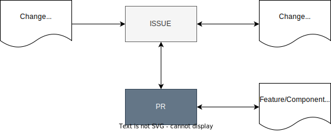
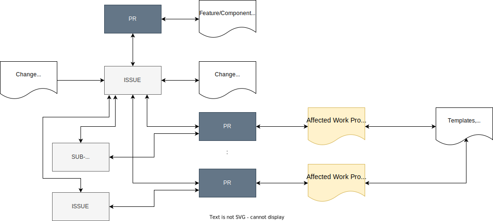
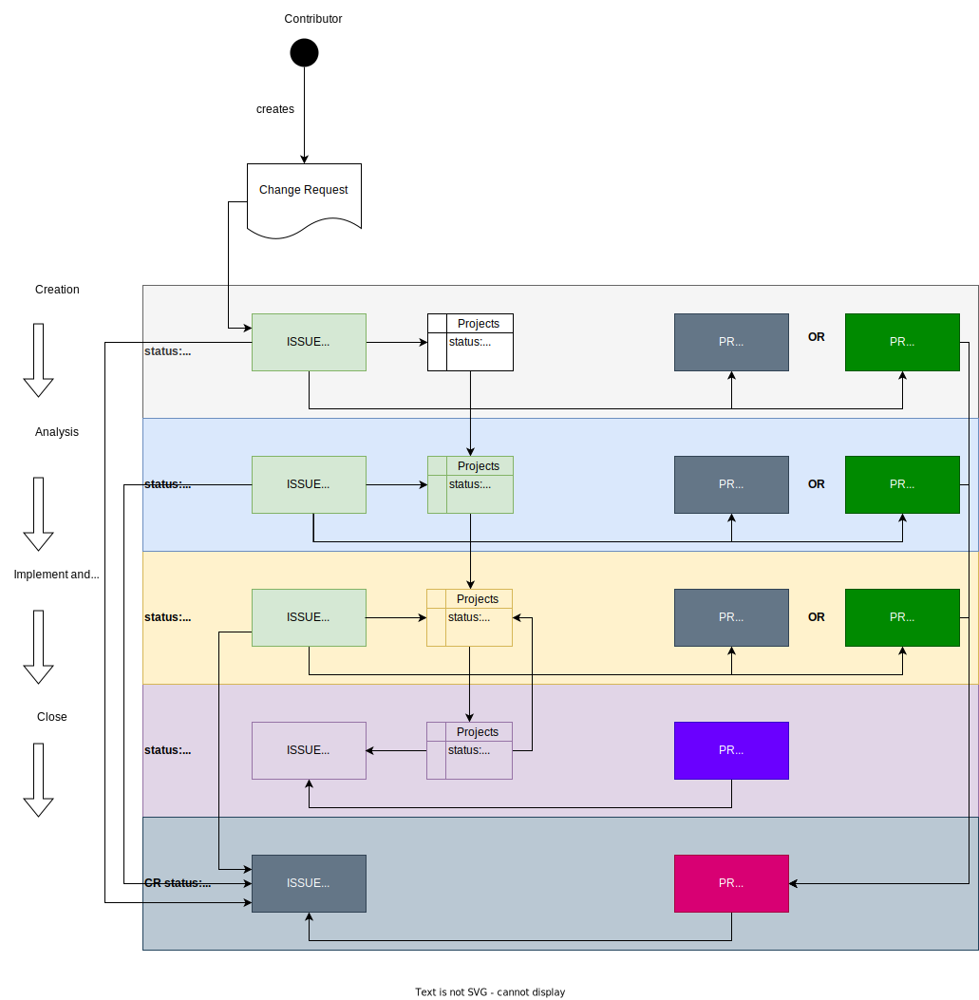

..
   # *******************************************************************************
   # Copyright (c) 2025 Contributors to the Eclipse Foundation
   #
   # See the NOTICE file(s) distributed with this work for additional
   # information regarding copyright ownership.
   #
   # This program and the accompanying materials are made available under the
   # terms of the Apache License Version 2.0 which is available at
   # https://www.apache.org/licenses/LICENSE-2.0
   #
   # SPDX-License-Identifier: Apache-2.0
   # *******************************************************************************

.. document:: Change Management Plan
   :id: doc__platform_change_management_plan
   :status: valid
   :safety: ASIL_B
   :security: YES
   :tags: platform_management
   :realizes: wp__chm_plan

.. _change_mgmt_plan:

Change Management / Change Management Plan
------------------------------------------

This document implements parts of the :need:`wp__platform_mgmt`.

Purpose
+++++++
The purpose of the Change Management Plan is to guide the execution of the
Change Requests of a project including their creation, analysis, implementation, closure and
control. Where a change is defined as an introduction of a new feature/component or modification of
an existing feature/component.

Objectives and Scope
++++++++++++++++++++

Change Management Goals
^^^^^^^^^^^^^^^^^^^^^^^

* Change Requests are recorded and identified.
* Change Requests are analyzed, affected work products are identified, and the impact is estimated.
* Change Requests are approved before implementation.
* Change Requests are implemented and monitored.
* Changes Requests are tracked until closure and and communicated to affected parties.
* Change Requests and affected work products are bidirectionally traced.

Approach
++++++++

Change Request Execution
^^^^^^^^^^^^^^^^^^^^^^^^

Contributions in general to the **S-CORE** project are described here
(compare :need:`doc__contr_guideline`).

A Change Request is a specific contribution, and it is the **ONLY** way to contribute new
features/components or to modify the scope of existing features/components in the **S-CORE**
project.

Change Request Infrastructure and Types
^^^^^^^^^^^^^^^^^^^^^^^^^^^^^^^^^^^^^^^

:need:`GitHub Issues (ISSUE) <doc__issue_guideline>` are used for managing Change Requests.
The tool is used to create, analyze, implement and monitor Change Requests within **S-CORE**.

:need:`GitHub Pull Requests (PR) <doc__pull_request_guideline>` are used for the documentation and
implementation of Change Requests. The tool is used to document, implement and verify Change
Requests within **S-CORE**.

The next figure gives an overview, how Change Requests are realized in **S-CORE**. An ISSUE and PR
is used to create a Change Request including required attributes as defined in
:need:`gd_req__change_attr_uid`.

  Change Request Simple Overview

Therefore the Change Template :need:`gd_temp__change_feature_request` or
:need:`gd_temp__change_component_request` shall be used.
In addition  :need:`Impact Analysis Template <gd_temp__change_impact_analysis>` should be
used, if applicable.

.. note::
  Parts of the template are automatically included in the ISSUE **Change Request**.
  Use ISSUE **Change Request** to request a change in **S-CORE**.

  .. figure:: _assets/score_change_request_change.drawio.svg
    :width: 100%
    :align: center
    :alt: Change Request Change

The ISSUE may be linked to other ISSUEs or SUB-ISSUEs, if required, to manage more complex Change
Requests. The implementation of a Change Request requires at least one PR linked to the ISSUE
created for the Change Request.

  Change Request Overview

Changes are clustered in the following types:

.. list-table:: Change Request Types
   :header-rows: 1
   :widths: 15,85,15

   * - Type
     - Description
     - Infrastructure
   * - Feature
     - Created by :need:`Contributor <rl__contributor>` to change requirements and work products, new feature
     - ISSUE with label ``feature_request``
   * - Feature Modification
     - Created by :need:`Contributor <rl__contributor>` to change requirements and work products, scope change
     - ISSUE with label ``feature_modification``
   * - Component
     - Created by :need:`Contributor <rl__contributor>` to change requirements and work products, new component
     - ISSUE with label ``component_request``
   * - Component Modification
     - Created by :need:`Contributor <rl__contributor>` to change requirements and work products, scope change
     - ISSUE with label ``component_modification``

Change Request Traceability Impact Analysis requires the following tools:

:need:`[[title]] <gd_req__change_tool_impact_analysis>`

Change Request Attributes
^^^^^^^^^^^^^^^^^^^^^^^^^
:need:`gd_req__change_attr_uid` are implemented as follows:

:need:`[[title]] <gd_req__change_attr_uid>` is identical to the ISSUE number.

:need:`[[title]] <gd_req__change_attr_status>` is defined by the combination of the ISSUE
state, the state in the Projects dashboard view and the PR status.

.. list-table:: Change Status
   :header-rows: 1
   :widths: 15,85,15,15

   * - Status
     - Issue status
     - Projects dashboard status
     - Linked PR status
   * - open
     - ``Open``
     - ``No Status``
     - ``Draft`` or ``Open``
   * - in review
     - ``Open``
     - ``Todo``
     - ``Draft`` or ``Open``
   * - in implementation
     - ``Open``
     - ``In Progress``
     - ``Draft`` or ``Open``
   * - closed
     - ``Closed``
     - ``Done``
     - ``Merged``
   * - rejected
     - ``Closed as not planned``
     - na
     - na

:need:`[[title]] <gd_req__change_attr_title>` is identical to the ISSUE title.

:need:`[[title]] <gd_req__change_attr_impact_description>` is initially provided in the
Description and Impact analysis part of the ISSUE. Further detailed analysis results are part of
the linked PR, provided as part of the feature/request templates.

Further information about detailed implementation can be provided in the Realize part of the ISSUE.

:need:`[[title]] <gd_req__change_attr_impact_safety>`,
:need:`[[title]] <gd_req__change_attr_impact_security>` are provided in the Safety or
Security relevance part of the ISSUE.

Combinations of them are allowed. If nothing is selected, Quality is relevant by default.

Use the ASIL classification part of the ISSUE to document the ASIL level concerned, e.g. ASIL_B.

:need:`[[title]] <gd_req__change_attr_types>` is provided in the Change Request Type
part of the ISSUE, further in the linked PR for feature or component request.

:need:`[[title]] <gd_req__change_attr_affected_wp>` is initially provided in the
Affected work products part of the ISSUE. Further detailed affected work products are part of the
linked PR or other ISSUEs.

:need:`[[title]] <gd_req__change_attr_milestone>` is provided in the Expected Implementation
Version part of the ISSUE. Optionally the Milestone part of the ISSUE can be set.

.. _change_mgmt_workflow:

Change Request Workflow
^^^^^^^^^^^^^^^^^^^^^^^

In general, every Change Request follows the following steps:

(color is referring to the following figure: Problem Resolution Simple Workflow Overview)

* 1. Create the Change Request (grey color)
* 2. Analyze the Change Request (blue color)
* 3. Initiate the implementation of the Change Request and track it to closure (yellow color)
* 4. Close Change Request (purple color)

:need:`gd_guidl__change_change_request` can give additional help.

**To 1. Create the Change Request:**

An ISSUE is the **ONLY** way to create and manage a Change Request in **S-CORE**.
A PR is the **ONLY** way to document and implement a Change Request in **S-CORE**,
thus an ISSUE must be linked at least to one or more PRs.

The figure below shows the workflow for the simplest case of a Change Request.

An ISSUE with the with the type ``Enhancement`` is created in status ``Open``.
The title of the ISSUE reflects the potential change. Further fill out the provided template
content accordingly.

The description of the ISSUE may give a brief description and impact analysis of the requested
change. The details are part of the Feature/Component Request and Impact Analysis provided by a PR,
which is linked  to the ISSUE in status ``Draft`` or ``Open``.

For a new Feature/Component Request the provided templates :need:`Feature Request<gd_temp__change_feature_request>`,
or :need:`Component Request<gd_temp__change_component_request>` must be used. For a
modification of an existing Feature/Component, update the existing work products.
Further add here the :need:`Impact Analysis Template <gd_temp__change_impact_analysis>`
and fill it out accordingly, if applicable.

The description of the ISSUE may give a brief description of the affected work products and also
details about the intended realization for the change.
The linked PR in status ``Draft``, which contains the Feature/Component Requests, may contain also
more details about the affected work products or realization and verification proposals.

Planning is done by setting the **Expected Implementation Version**. Optionally the Milestone of
the ISSUE can be set.

Change request status: ``open`` is implemented as ISSUE status ``Open`` and Projects status
``No Status``. The linked PR status is either ``Draft`` or ``Open``.

To trigger the next step: Change request status: ``in review``
keep the ISSUE status ``Open`` and set the Projects status ``Todo``.

To reject the change request: Change request status: ``rejected``
set the ISSUE status to ``Closed as not planned``.

  Change Request Simple Workflow Overview

**To 2. Analyze the Change Request:**

The Change Request is reviewed and analyzed from the :need:`Committer <rl__committer>` and the
review results are resolved by the :need:`Contributor <rl__contributor>`. The results
are documented in the ISSUE and/or linked PR. As long as the information is not sufficient, the
related ISSUE is kept in status ``Open`` and Projects status ``Todo``, means ``in review``.

If the information is sufficient and it is decided to implement the change request, the
ISSUE status is kept ``Open`` and the Projects status is set to ``In Progress``.

The decision, if the change request is accepted or rejected must be documented. Safety/Security
experts must confirm or disconfirm, if safety/security relevance is set correctly.

:need:`gd_chklst__change_cr_review` can help to verify whether the information is complete.

Otherwise, if the change requested is not accepted, the change request is rejected. To reject the
Change Request: Change Request status: ``rejected`` set the ISSUE status to ``Closed as not planned``.

**To 3. Initiate the implementation of the Change Request and track it to closure:**

:need:`Contributor <rl__contributor>` starts all required activities to implement the
change request. These may include further planning  activities by creating ISSUEs and required PRs.
All additional ISSUEs or PRs created to implement are linked to the Change Request ISSUE to enable
monitoring of the activities.

All activities defined are tracked until closure, means that all linked ISSUEs or PRs are closed or
merged, respectively.

If all are closed or merged :need:`Contributor <rl__contributor>` sets Projects status to
``Done`` to trigger the final review from the :need:`Committer <rl__committer>` to close
the Change Request.

The Change Request may also rejected in this phase, then the ISSUE status is set to
``Closed as not planned``.

**To 4. Close Change Request :**

:need:`Committer <rl__committer>` checks finally if the change request is completely
implemented. In this case all linked ISSUEs or PRs are closed or merged, respectively.

Especially the verification measures must be checked for their effectiveness and the argumentation
is convincing.

:need:`gd_chklst__change_cr_review` can help to verify whether it can be closed.
The realization parts of the Change Request are reviewed according the checklists of the affected
work products. Verification of the realization parts must be successful.

If this is the case the ISSUE status is set to ``Closed``, otherwise the Projects status is set
back to ``In Progress``.

Change Management SW Platform Work Products
^^^^^^^^^^^^^^^^^^^^^^^^^^^^^^^^^^^^^^^^^^^

not applicable
