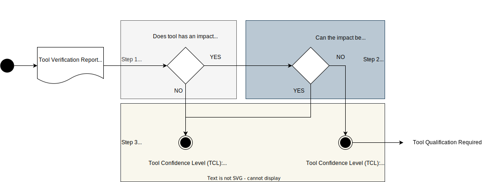

..
   # *******************************************************************************
   # Copyright (c) 2024 Contributors to the Eclipse Foundation
   #
   # See the NOTICE file(s) distributed with this work for additional
   # information regarding copyright ownership.
   #
   # This program and the accompanying materials are made available under the
   # terms of the Apache License Version 2.0 which is available at
   # https://www.apache.org/licenses/LICENSE-2.0
   #
   # SPDX-License-Identifier: Apache-2.0
   # *******************************************************************************

.. document:: Tool Management Plan
   :id: doc__platform_tool_management_plan
   :status: valid
   :safety: ASIL_B
   :security: YES
   :tags: platform_management
   :realizes: wp__tlm_plan

Tool Management/ Tool Management Plan
-------------------------------------

This document implements parts of the :need:`wp__platform_mgmt`.

Purpose
+++++++
The purpose of the Tool Management Plan is to guide the identification, evaluation and, if
applicable, the qualification (safe and secure use) of Tools for the S-CORE project.

S-CORE guideline is to use as much as possible Tools for the generation of all required work
products. Thus all Tools which will be used as part of the tool chain for the work product
generation must be identified, documented and evaluated and if applicable, qualified.

Objectives and Scope
++++++++++++++++++++

Tool Management Goals
^^^^^^^^^^^^^^^^^^^^^

* Tools are identified and documented
* Tools are evaluated
* Tools are qualified, if applicable
* Tool Verification Reports are released

Approach
++++++++

.. figure:: _assets/score_tool_management_overview.drawio.svg
  :width: 100%
  :align: center
  :alt: Tool Management Overview

Tool Management Attributes
^^^^^^^^^^^^^^^^^^^^^^^^^^
:need:`gd_req__tool_attr_uid` are implemented as follows:

Identification
^^^^^^^^^^^^^^

Each tool is identified by its name or UID and its version, independent where it is located.

The most important tools are stored in one GitHub repository,
`tooling repository <https://GitHub.com/eclipse-score/tooling/>`_.

But in general Tool can be stored all over the place.

For each Tool the :need:`gd_temp__tool_management_verif_rpt_template` shall be used to document
the relevant information.

:need:`gd_chklst__tool_cr_review` shall be used to check that all relevant information is considered.

The configuration of tools is part of the :need:`doc__config_mgt_plan`.

The output after this stage is the :need:`wp__tool_verification_report` in status: `identified`.

Evaluation
^^^^^^^^^^

The tool confidence level (TCL) must be determined as outlined in the
:need:`doc_concept__tool_process`.

Step-by-Step guide:

1. Determine the tool impact
2. Determine the tool error detection
3. Determine the tool confidence level

**To Step 1**

Based on the found malfunctions or threats judge, if any safety or security requirements may violated.
If this is the case, determine tool impact to "YES" otherwise to "NO".

If tool impact is "NO", continue with 3, otherwise 2.

**To Step 2**

Based on the malfunctions or threats found, assess whether these can be detected or prevented.
Consider also potential safety measures and security controls to increase the detection and
prevention of these, if applicable.
If there is no guarantee to either detect or prevent these, judge tool error detection to "NO",
otherwise to "YES".

**To Step 3**

If tool impact is judged to "YES" and tool error detection judged to "NO", the tool confidence
level is determined to "LOW", otherwise "HIGH".

In case the tool confidence level is "LOW", tool qualification is required.

The output after this stage is the :need:`wp__tool_verification_report` in status: `evaluated`.

Qualification
^^^^^^^^^^^^^

As method "validation of software tool" is applied.

Specify requirements for the tools purpose and usage in the S-CORE context.
Analyze the malfunctions and threats and specify additional safety measures and security controls
to increase the prevention and detection of them.
Specify test cases and tests to verify the requirements and generate a test report.
Update the Tool Verification Report accordingly to document the outcomes.

For the generation of requirements, verification and analyses the existing processes as defined
in the :need:`wp__platform_mgmt` shall be used.

In detail:

* Use :need:`wf__req_comp_req` to create requirements for the software tool and :need:`wf__monitor_verify_requirements` for the verification

* Use :need:`wf__verification_comp_int_test` to test the requirements for the software tool and :need:`wf__verification_mod_ver_report` to report

* If applicable, use for the Analyses: (to be added, after Safety/Security Analyses have been merged)

The output after this stage is the :need:`wp__tool_verification_report` in status: `qualified`.

Approval
^^^^^^^^

Finally the tool may accepted for the S-CORE project. Thus the Tool Verification Report after this
stage is the :need:`wp__tool_verification_report` in status: `released`.

If not, the tool is rejected, thus Tool Verification Report after this
stage is the :need:`wp__tool_verification_report` in status: `rejected`.

Tailoring
^^^^^^^^^
Tailoring of safety activities for confidence in the use of software tools:

The following ISO 26262 defined safety requirements are not relevant for the S-CORE SW platform
development, as they are not used:

:need:`std_req__iso26262__support_11471`, :need:`std_req__iso26262__support_11472`,
:need:`std_req__iso26262__support_11473`, :need:`std_req__iso26262__support_11474`,
:need:`std_req__iso26262__support_11481`, :need:`std_req__iso26262__support_11482`,
:need:`std_req__iso26262__support_11483`

Tool List
^^^^^^^^^

The S-CORE tools overview can be found here: :ref:`tools`
