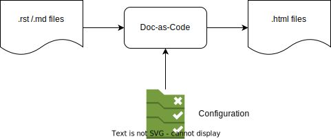

..
   # *******************************************************************************
   # Copyright (c) 2025 Contributors to the Eclipse Foundation
   #
   # See the NOTICE file(s) distributed with this work for additional
   # information regarding copyright ownership.
   #
   # This program and the accompanying materials are made available under the
   # terms of the Apache License Version 2.0 which is available at
   # https://www.apache.org/licenses/LICENSE-2.0
   #
   # SPDX-License-Identifier: Apache-2.0
   # *******************************************************************************

.. doc_tool:: Doc-as-Code
   :id: doc_tool__doc_as_code
   :status: evaluated
   :version: v2.2.0
   :tcl: LOW
   :safety_affected: YES
   :security_affected: YES
   :realizes: wp__tool_verification_report
   :tags: tool_management

Doc-as-Code Verification Report
===============================

Introduction
------------

Scope and purpose
~~~~~~~~~~~~~~~~~
Generate documentation (.html files) based on text files (.rst / .md) and configuration data.

Inputs and outputs
~~~~~~~~~~~~~~~~~~

Inputs are restructured text files (.rst) and markdown files (,md)
Outputs are HTML files (.html)

  Doc-as-Code overview

Available information
~~~~~~~~~~~~~~~~~~~~~

Project Documentation is available here:

`Doc-as-Code Project Documentation <https://eclipse-score.github.io/docs-as-code/main/index.html>`_

This includes getting started or usage information and integration manual.

The capabilities of the tool can be found here:

`Doc-as-Code Project Capabilities <https://eclipse-score.github.io/docs-as-code/main/internals/requirements/capabilities.html>`_

Installation and integration
----------------------------

Tool location:

`Release v2.2.0 <https://github.com/eclipse-score/docs-as-code/tree/v2.2.0>`_

How to integrate:

`Doc-as-Code Setup <https://eclipse-score.github.io/docs-as-code/main/how-to/setup.html>`_

Environment: Bazel

Supported platforms: Linux

Evaluation
----------

.. list-table:: S-CORE software modules overview
   :header-rows: 1

   * - Use case Identification
     - Use case Description
     - Malfunctions
     - Impact on safety?
     - Impact safety measures available?
     - Impact safety detection sufficient?
     - Threats
     - Impact on security?
     - Impact security measures available?
     - Impact security detection sufficient?
     - Further additional safety measure required?
     - Confidence (automatic calculation)
   * - 1
     - Generate element (requirements, architecture, safety analysis, ...)
     - Wrong or missed element may lead to an wrong implementation with any potential error
     - yes
     - Reviews
     - no
     - Gain access to modify or run manipulated Doc-as-code or to to modify input files
     - yes
     - Access control, roles in Github
     - yes
     - Compare generated text in documentation with original text (#PR)
     - low
   * - 2
     - Link elements
     - Wrong or missed links may lead to wrong elements and finally to wrong implementation with any potential error
     - yes
     - Reviews, Link rules checker
     - no
     - Gain access to modify or run manipulated Doc-as-code or to to modify input files
     - yes
     - Access control, roles in Github
     - yes
     - Compare generated links in documentation with original links (#PR)
     - low
   * - 3
     - Generate statistics
     - Wrong or missing statistics may lead to wrong compliance statements, KPI reports, decisions
     - yes
     - Spot checks
     - no
     - Gain access to modify or run manipulated Doc-as-code or to to modify input files
     - yes
     - Access control, roles in Github
     - yes
     - Add diverse statistic generator tool (#PR)
     - low
   * - 4
     - Check documentation rules based on configuration
     - Checks are not properly implemented, so may lead to wrong elements/links
     - yes
     - Code reviews, test for rules
     - yes
     - Gain access to modify or run manipulated Doc-as-code or to to modify input files
     - yes
     - Access control, roles in Github
     - yes
     - n/a
     - high

Result
~~~~~~
Tool Qualification Required

Tool Qualification
------------------
Based on method: validation of the software tool

Requirements and testing aspects
--------------------------------
Tool requirements are defined here:

`Doc-as-Code Requirements <https://eclipse-score.github.io/docs-as-code/main/internals/requirements/requirements.html>`_

Test cases and tests are defined here:

`Doc-as-Code Test cases and tests <https://github.com/eclipse-score/docs-as-code/tree/v2.2.0/src/extensions>`_

The tests are part of the rules checker code sections.

Requirements coverage is documented here:

`Doc-as-Code Requirements <https://eclipse-score.github.io/docs-as-code/main/internals/requirements/requirements.html>`_
