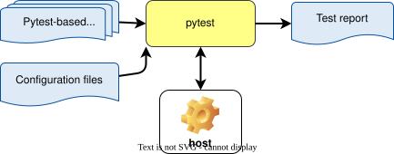

..
   # *******************************************************************************
   # Copyright (c) 2026 Contributors to the Eclipse Foundation
   #
   # See the NOTICE file(s) distributed with this work for additional
   # information regarding copyright ownership.
   #
   # This program and the accompanying materials are made available under the
   # terms of the Apache License Version 2.0 which is available at
   # https://www.apache.org/licenses/LICENSE-2.0
   #
   # SPDX-License-Identifier: Apache-2.0
   # *******************************************************************************

.. doc_tool:: pytest
   :id: doc_tool__pytest
   :status: evaluated
   :version: 1
   :tool_version: 9.0.3
   :tcl: LOW
   :safety_affected: YES
   :security_affected: YES
   :realizes: wp__tool_verification_report
   :tags: tool_management, tools_testing_frameworks

Pytest Verification Report
==========================

Introduction
------------
Scope and purpose
~~~~~~~~~~~~~~~~~
Pytest is a Python testing framework that supports unit, integration and system
testing. It provides fixtures, plugins, and multiple reporting formats to help
developers write readable and maintainable tests for Python projects.

Some S-CORE modules use pytest as a testing framework for unit and integration tests.

Inputs and outputs
~~~~~~~~~~~~~~~~~~
| Inputs: Pytest-based test files (Python), Configuration files
| Outputs: Test report (console output, XML/HTML reports), logs

  Pytest overview

Available information
~~~~~~~~~~~~~~~~~~~~~
- Version: 9.0.3 [1]_ [2]_
- S-CORE repository: https://github.com/eclipse-score/tooling/tree/main/python_basics/score_pytest
- Official repository: https://github.com/pytest-dev/pytest
- Official documentation: https://docs.pytest.org
- Plugin ecosystem: https://docs.pytest.org/en/stable/reference.html#plugins
- Example usage in S-CORE: inspect `pyproject.toml` / `pytest.ini` in project modules

Installation and integration
----------------------------
Installation
~~~~~~~~~~~~
| To add the Pytest Bazel dependency to your project or module, include the following line in your MODULE.bazel file:

.. code-block:: bash

    bazel_dep(name = "score_python_basics", version = "x.y.z")

Integration
~~~~~~~~~~~
Pytest integrates with Python projects via `pytest.ini`, `pyproject.toml`, or
`tox.ini` or via part of any other tools (e.g. ITF).

Environment
~~~~~~~~~~~
Requires a supported Python interpreter and any test-time dependencies (mocking,
test-data fixtures). CI runners must preserve environment variables and paths
needed by tests.

Safety evaluation
-----------------
This section outlines the safety evaluation of Pytest for its use within the
S-CORE project.

.. list-table:: Safety evaluation
   :header-rows: 1
   :widths: 1 2 8 2 6 4 2 2

   * - Malfunction identification
     - Use case description
     - Malfunctions
     - Impact on safety?
     - Impact safety measures available?
     - Impact safety detection sufficient?
     - Further additional safety measure required?
     - Confidence (automatic calculation)
   * - 1
     - Run tests and generate test report
     - | Fails to load input files
       |
       | Pytest fails to load provided file even if file is present and accessible.
     - yes
     - (implicit) Check test run status
     - yes
     - no
     - high
   * - 2
     - Run tests and generate test report
     - | Fails to write result to file
       |
       | Pytest was not able to save results in file(s).
     - yes
     - (implicit) Check test run status
     - yes
     - no
     - high
   * - 3
     - Run tests and generate test report
     - | Fails to collect results of the test(s)
       |
       | Pytest was not able to collect results of executed test and generate test report.
     - no
     - no
     - yes
     - no
     - high
   * - 4
     - Run tests and generate test report
     - | Fails to detect an existing error
       |
       | Pytest fails to detect the presence of existing errors.
     - yes
     - no
     - no
     - yes (qualification)
     - low
   * - 5
     - Run tests and generate test report
     - | Indicates presence of a non-existing error
       |
       | Pytest indicates the presence of errors that do not exist.
     - no
     - no
     - yes
     - no
     - high
   * - 6
     - Run tests and generate test report
     - | Fails to execute the test
       |
       | Pytest fails to execute specific test from the test plan
     - yes
     - | - (implicit) Check test run status
       | - Review test report for completeness (all expected tests are executed)
     - yes
     - no
     - high
   * - 7
     - Run tests and generate test report
     - | Produces wrong test report
       |
       | Pytest fails to save correct test result in test report.
     - yes
     - Review test report for correctness (format is correct) and completeness (all expected tests are executed)
     - yes
     - no
     - high

Security evaluation
-------------------
This section outlines the security evaluation of Pytest for use within the
S-CORE project.

.. list-table:: Security evaluation
   :header-rows: 1

   * - Threat identification
     - Use case description
     - Threats
     - Impact on security?
     - Impact security measures available?
     - Impact security detection sufficient?
   * - 1
     - TBD
     - TBD
     - TBD
     - TBD
     - TBD

Result
~~~~~~
Pytest requires qualification for use in safety-related software development
according to ISO 26262.

**Tool Qualification**
----------------------
Based on method: validation of the software tool.

.. note::
  Pytest is an integral component of ITF and may be qualified either as part of the ITF qualification
  process or independently, in which case the resulting qualification shall also be applicable to ITF.

Requirements and testing aspects
~~~~~~~~~~~~~~~~~~~~~~~~~~~~~~~~
Pytest is an open-source framework and does not provide formal, vendor-defined
requirements. Project teams must derive requirements for the specific pytest
features and plugins used and validate pytest against these requirements.

.. [1] The tool version mentioned in this document is preliminary.
       It is subject to change and will be updated in future.
.. [2] https://github.com/eclipse-score/tooling/blob/main/python_basics/requirements_3_11.txt or
       https://github.com/eclipse-score/tooling/blob/main/python_basics/requirements_3_12.txt
