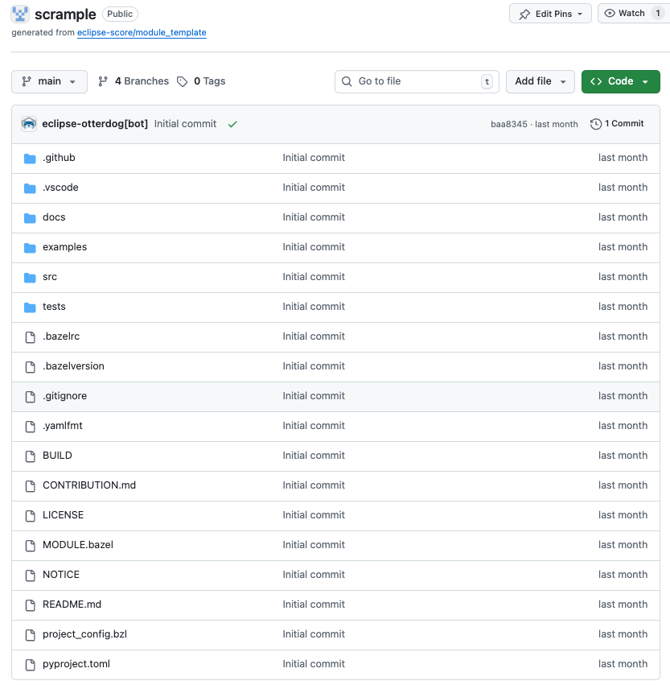

..
   # *******************************************************************************
   # Copyright (c) 2026 Contributors to the Eclipse Foundation
   #
   # See the NOTICE file(s) distributed with this work for additional
   # information regarding copyright ownership.
   #
   # This program and the accompanying materials are made available under the
   # terms of the Apache License Version 2.0 which is available at
   # https://www.apache.org/licenses/LICENSE-2.0
   #
   # SPDX-License-Identifier: Apache-2.0
   # *******************************************************************************

First Eclipse S-CORE Module
=================================

Before starting, ensure you are an official contributor to the Eclipse S-CORE project.
Otherwise, you will not have required permissions. Instructions can be found in
`Actions to ensure Proper Contribution Attribution in Eclipse S-CORE <https://eclipse-score.github.io/score/main/contribute/general/contribution_attribution.html#>`_.

Once you have created an Eclipse account,
accepted Eclipse Contributor Agreement (ECA), and linked your GitHub account with your Eclipse Account,
contact one of the Eclipse S-CORE Project Leads (listed at the official `Eclipse SDV S-Core webpage <https://projects.eclipse.org/projects/automotive.score/who>`_).
They will add you to the list of the official contributors of the Eclipse S-CORE GitHub organization.

The recommended communication channel to approach Eclipse S-CORE project leads is the
`eclipse sdv slack channel <https://sdv.eclipse.org/get-engaged/>`_.

Creating a Repository for Your Module
------------------------------------------
After becoming part of Eclipse S-CORE GitHub organization, you can create a repository for your module.
Repository creation follows Eclipse organizational rules.
Most configuration is handled via `otterdog configuration <https://otterdog.readthedocs.io/en/latest/>`_ located in:

- `eclipse-score/.eclipsefdn <https://github.com/eclipse-score/.eclipsefdn>`_

Create a private fork of this repository and modify the file:

- `otterdog/eclipse-score.jsonnet <https://github.com/eclipse-score/.eclipsefdn/blob/main/otterdog/eclipse-score.jsonnet>`_

Add your repository definition, e.g.:

.. code-block:: python
    :emphasize-lines: 4, 5, 6

    newModuleRepo('logging') {
        description: "Repository for logging framework",
    },
    newModuleRepo('scrample') {
        description: "Repository for example component",
    },
    newModuleRepo('inc_abi_compatible_datatypes') {
        description: "Incubation repository for ABI compatible data types feature",
    },

Then, create a PR in the `eclipse-score/.eclipsefdn <https://github.com/eclipse-score/.eclipsefdn>`_ repository. The PR must be approved by:

- Eclipse S-CORE project lead
- Eclipse Foundation Security Team

.. tip::

    To speed up approval, mention both groups in your PR comment:

    .. code-block:: python

        @eclipse-score/automotive-score-project-leads
        @eclipse-score/eclipsefdn-security

        Please approve.

Repository Layout
^^^^^^^^^^^^^^^^^^
Once merged, your new repository will appear in the Eclipse S-CORE GitHub organization repositories overview.

All repositories are created using the `Eclipse S-CORE module template <https://github.com/eclipse-score/module_template>`_.

The `README.md <https://github.com/eclipse-score/module_template/blob/main/README.md>`_ file already explains the basic structure.
Below is an overview of the most relevant files and folders.

.github/workflows/
------------------
Contains CI/CD workflows (build, unit-tests,
:ref:`integration gate <integration_process>` checks).

.vscode
------------------
Provides Eclipse S-CORE recommended VS Code setup, including code completion patterns for requirements and architecture in
`.vscode/restructuredtext.code-snippets <https://github.com/eclipse-score/module_template/blob/main/.vscode/restructuredtext.code-snippets>`_.

.. tip::
    The Eclipse S-CORE project provides a ready-to-use
    `Dev Container <https://github.com/eclipse-score/devcontainer>`_
    with all required tools pre-installed.
    Open any module repository with the
    `VS Code Dev Containers extension <https://marketplace.visualstudio.com/items?itemName=ms-vscode-remote.remote-containers>`_
    to skip manual toolchain setup entirely.

docs
-----
Place all module documentation here in `rst format <https://www.sphinx-doc.org/en/master/usage/restructuredtext/index.html>`_.
Examples follow later in this guide.

.. tip::
    We try to describe most `common workflows <https://eclipse-score.github.io/score/main/contribute/contribution_request/index.html#doc__contr_guideline>`_
    for developers. It is worth checking it.

score/
-------
Source files and unit tests for the module.
Follows the naming convention ``score/<module_name>/``.

tests/
-------
Component Integration Tests (CIT) and Feature Integration Tests (FIT).
See the :ref:`Technology Overview <technology_overview>` for details on test levels.

.bazelrc
--------
Defines bazel configuration for your the module.
Important entries in `.bazelrc <https://github.com/eclipse-score/scrample/blob/v0.1.2-simple-app/.bazelrc>`_ file include:

.. code-block:: python
    :linenos:
    :emphasize-lines: 8, 9

    build --java_language_version=17
    build --tool_java_language_version=17
    build --java_runtime_version=remotejdk_17
    build --tool_java_runtime_version=remotejdk_17

    test --test_output=errors

    common --registry=https://raw.githubusercontent.com/eclipse-score/bazel_registry/main/
    common --registry=https://bcr.bazel.build

- Line number 8 points to the Eclipse S-CORE https://github.com/eclipse-score/bazel_registry,
  where all official versions of Eclipse S-CORE modules are published.

- Line number 9 points to the common bazel registry, where common bazel modules are made available for everyone.

This means, once we´re referencing a depending module with our scrample application,
bazel will start searching it in one of these two locations.

MODULE.bazel
-------------
This file turns your repository into a bazel module.

Let us check `MODULE.bazel <https://github.com/eclipse-score/scrample/blob/v0.1.2-simple-app/MODULE.bazel>`_ initial content:

.. code-block:: python
    :linenos:

    module(
        name = "cpp_rust_template_repository",
        version = "1.0",
    )

Here, we´re making the first declaration of our module by defining a name and a version.
Please be aware, that only after our module was published in the Eclipse S-CORE bazel registry, other modules can access it.

Rename the module and replace *cpp_rust_template_repository* by your module name, in our case *score_scrample*.
Use `semantic versioning <https://semver.org/>`_ for the module version, starting at ``0.1.0``.

.. code-block:: python
    :linenos:

    module(
        name = "score_scrample",
        version = "0.1.0",
    )

Please be aware, according to Eclipse S-CORE´s naming convention all module names must start with *score\_* prefix.

.. code-block:: python
    :linenos:

    bazel_dep(name = "rules_python", version = "1.4.1")

    PYTHON_VERSION = "3.12"

    python = use_extension("@rules_python//python/extensions:python.bzl", "python")
    python.toolchain(
        is_default = True,
        python_version = PYTHON_VERSION,
    )
    use_repo(python, "python_versions")

    # Add GoogleTest dependency
    bazel_dep(name = "googletest", version = "1.17.0")

    # Rust rules for Bazel
    bazel_dep(name = "rules_rust", version = "0.63.0")

    # C/C++ rules for Bazel
    bazel_dep(name = "rules_cc", version = "0.2.1")

In the code snippet above, we declare dependencies to modules, that are publicly available in common bazel registry, e.g.
for unit test execution with gtest.

.. code-block:: python
    :linenos:

    # C++ and QNX toolchains (same setup as score_baselibs / score_baselibs_rust)
    bazel_dep(name = "score_bazel_cpp_toolchains", version = "0.5.1", dev_dependency = True)

    gcc = use_extension("@score_bazel_cpp_toolchains//extensions:gcc.bzl", "gcc", dev_dependency = True)
    gcc.toolchain(
        name = "score_gcc_x86_64_toolchain",
        target_cpu = "x86_64",
        target_os = "linux",
        use_default_package = True,
        version = "12.2.0",
    )
    gcc.toolchain(
        name = "score_qcc_x86_64_toolchain",
        sdp_version = "8.0.0",
        target_cpu = "x86_64",
        target_os = "qnx",
        use_default_package = True,
        version = "12.2.0",
    )
    use_repo(
        gcc,
        "score_gcc_x86_64_toolchain",
        "score_qcc_x86_64_toolchain",
    )

    # Ferrocene Rust toolchains (QNX cross-compilation support)
    bazel_dep(name = "score_toolchains_rust", version = "0.9.1", dev_dependency = True)

Here we add C++ and Rust toolchains using ``score_bazel_cpp_toolchains`` and ``score_toolchains_rust``.
These provide GCC 12.2.0 for Linux host builds, QCC (QNX SDP 8.0.0) for QNX cross-compilation,
and Ferrocene toolchains for Rust (including QNX support).
In upcoming chapters, we will talk about this in more detail.

.. code-block:: python
    :linenos:

    # tooling
    bazel_dep(name = "score_tooling", version = "1.1.2")

    # docs-as-code
    bazel_dep(name = "score_docs_as_code", version = "4.0.3")

    # Rust linting and formatting policies
    bazel_dep(name = "score_rust_policies", version = "0.0.3")

Finally, we add dependencies to Eclipse S-CORE native modules:

- **score_tooling**: enables tooling checks such as copyright and license verification.
- **score_docs_as_code**: enables documentation builds with Sphinx and sphinx-needs.
- **score_rust_policies**: provides centralised Rust linting (clippy) and formatting (rustfmt) policies.
  For C++ projects, use ``score_cpp_policies`` instead.

.. tip::
    Working across multiple modules and repositories can be challenging. Use the following approach during development:

    - use `git_override()  <https://bazel.build/rules/lib/globals/module#git_override>`_
      if you want to use a version of another module, that is currently not officially availabe in the bazel registry.

    - use `local_path_override()  <https://bazel.build/rules/lib/globals/module#local_path_override>`_
      if you want to use your local version of the module, e.g. during active development.

BUILD
-----
The bazel `BUILD <https://github.com/eclipse-score/scrample/blob/v0.1.2-simple-app/BUILD>`_ file
contains main bazel targets on the top level of the scrample project:

.. code-block:: python
    :linenos:

    load("@score_docs_as_code//:docs.bzl", "docs")
    load("@score_tooling//:defs.bzl", "copyright_checker", "dash_license_checker", "setup_starpls", "use_format_targets")
    load("//:project_config.bzl", "PROJECT_CONFIG")

First, we load bazel rules and macros, implemented in Eclipse S-CORE context from the modules,
that we’ve defined as dependencies in the MODULE.bazel file, e.g. https://github.com/eclipse-score/docs-as-code.

.. code-block:: python
    :linenos:

    copyright_checker(
        name = "copyright",
        srcs = [
            "src_cpp",
            "tests",
            "//:BUILD",
            "//:MODULE.bazel",
        ],
        config = "@score_tooling//cr_checker/resources:config",
        template = "@score_tooling//cr_checker/resources:templates",
        visibility = ["//visibility:public"],
    )

    dash_license_checker(
        src = "//examples:cargo_lock",
        file_type = "",  # let it auto-detect based on project_config
        project_config = PROJECT_CONFIG,
        visibility = ["//visibility:public"],
    )

Second, we define bazel targets for *copyright_checker* and *dash_license_checker*,
based on bazel rules implemented and imported from https://github.com/eclipse-score/tooling module.

.. code-block:: python
    :linenos:

    docs(
        source_dir = "docs",
    )

Finally, the *docs* target builds all documentation in the .rst format, which is located in the
`docs <https://github.com/eclipse-score/docs-as-code/tree/main/docs>`_ folder and all its subfolders.
This functionality is implemented in `eclipse-score/docs-as-code <https://github.com/eclipse-score/docs-as-code>`_.

project_config.bzl
------------------
Every Eclipse S-CORE module must provide a ``project_config.bzl`` file in its root directory.
This file declares project-level metadata that is consumed by shared Bazel macros such as ``dash_license_checker``.

A minimal example:

.. code-block:: python
    :linenos:

    PROJECT_CONFIG = {
        "asil_level": "QM",        # Safety level: "QM", "ASIL-A", "ASIL-B", "ASIL-C", "ASIL-D"
        "source_code": ["cpp"],    # Languages used: "cpp", "rust", or both
    }

The ``asil_level`` is used by tooling to apply the appropriate quality and compliance checks.
The ``source_code`` list determines which license file types are scanned by ``dash_license_checker``
(e.g., ``Cargo.lock`` for Rust, ``requirements.txt`` for Python).

.. tip::
    Start with ``"asil_level": "QM"`` during initial development.
    The level can be raised once the module's safety concept is established.
