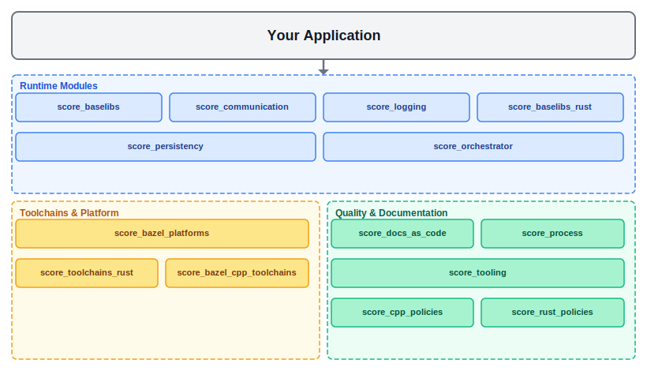
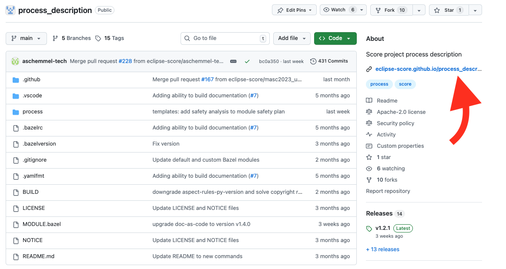
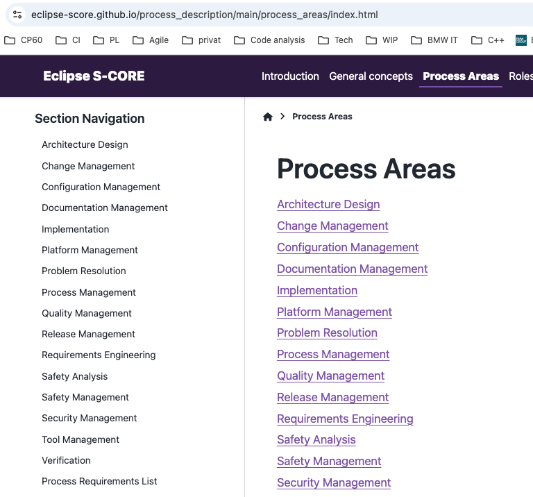

..
   # *******************************************************************************
   # Copyright (c) 2026 Contributors to the Eclipse Foundation
   #
   # See the NOTICE file(s) distributed with this work for additional
   # information regarding copyright ownership.
   #
   # This program and the accompanying materials are made available under the
   # terms of the Apache License Version 2.0 which is available at
   # https://www.apache.org/licenses/LICENSE-2.0
   #
   # SPDX-License-Identifier: Apache-2.0
   # *******************************************************************************

Module Structure Overview
==========================

As described in the :ref:`Technology Overview <technology_overview>` chapter, Eclipse S-CORE consists of multiple bazel modules,
typically stored in separate repositories. Most modules reside in the `Eclipse S-CORE GitHub organization <https://github.com/eclipse-score>`_,
while some originate from other Eclipse projects and are reused here. This chapter introduces
the most important bazel modules and repositories in Eclipse S-CORE GitHub organization.

Eclipse S-CORE Platform
-----------------------
**Repository:** `eclipse-score/score <https://github.com/eclipse-score/score>`_

This is the central repository of the project. It contains:

- stakeholder requirements
- Assumptions of Use (AoUs) for potential users
- the list of platform features
- the high-level architecture
- the decomposition of the architecture into modules
- the definition of logical interfaces and module functionality

Process Description
--------------------
**Repository:** `eclipse-score/process_description <https://github.com/eclipse-score/process_description>`_

.. hint::
    We automatically generate for every repository html documentation from rst files.
    You can easily open it as shown at the picture below.

The process repository describes the Eclipse S-CORE software development process. It describes:

- the general concepts and principles of the Eclipse S-CORE software development process
- all process areas in detail
- how work products such as requirements and architecture must be specified
- PMP describes, how the processes are deployed within S-CORE `Project Management Plan <https://eclipse-score.github.io/score/main/platform_management_plan/index.html>`_

Doc-as-Code
-----------
**Repository:** `eclipse-score/docs-as-code <https://github.com/eclipse-score/docs-as-code>`_

Doc-as-code repository provides the tooling around sphinx and sphinx-needs framework, including:

- traceability between requirements, architecture, and tests
- linking process artefacts
- checks that validate the Eclipse S-CORE metamodel, as defined in the process description

The implementation status of tooling requirements is available in the
`Tool Requirements Overview <https://eclipse-score.github.io/docs-as-code/main/requirements/requirements.html>`_.

Tooling
-------
**Repository:** `eclipse-score/tooling <https://github.com/eclipse-score/tooling>`_

Tooling repository collects all supporting tools for the Eclipse S-CORE project, e.g., format checkers.

Development Environment
-----------------------
**Repository:** `eclipse-score/devcontainer <https://github.com/eclipse-score/devcontainer>`_

Provides a common `Dev Container <https://containers.dev/>`_ for Eclipse S-CORE development.
Using the devcontainer is the recommended way to set up a fully configured development environment
with all required tools, compilers, and VS Code extensions pre-installed.

Clone the devcontainer repository and open it in VS Code with the
`Dev Containers extension <https://marketplace.visualstudio.com/items?itemName=ms-vscode-remote.remote-containers>`_
to get started in minutes.

Code Quality Policies
---------------------
**Repositories:**

- `eclipse-score/score_cpp_policies <https://github.com/eclipse-score/score_cpp_policies>`_
- `eclipse-score/score_rust_policies <https://github.com/eclipse-score/score_rust_policies>`_

These repositories provide centralised, version-controlled quality tool configurations:

- **score_cpp_policies**: clang-tidy rules, sanitiser configurations, and safety-critical C++ guidelines.
- **score_rust_policies**: Clippy linting rules and Rustfmt formatting configuration for Rust modules.

All modules are expected to depend on the appropriate policy package and cannot override
the shared rules without project-lead approval.

Toolchains and bazel platform
----------------------------------
**Repositories:**

- `eclipse-score/bazel_cpp_toolchains <https://github.com/eclipse-score/bazel_cpp_toolchains>`_
- `eclipse-score/toolchains_rust <https://github.com/eclipse-score/toolchains_rust>`_

The ``score_bazel_cpp_toolchains`` repository provides GCC-based C++ toolchains for all supported
targets, including Linux host builds (GCC 12.2.0) and QNX SDP 8.0.0 cross-compilation, replacing
the former separate ``toolchains_gcc`` and ``toolchains_qnx`` modules.
The ``score_toolchains_rust`` repository provides pre-built
`Ferrocene <https://ferrous-systems.com/ferrocene/>`_ toolchains for Rust, covering both Linux
host and QNX cross-compilation targets.
The ``score_bazel_platforms`` repository defines the platforms supported by Eclipse S-CORE
(e.g., ``x86_64-qnx-sdp_8.0.0-posix``), as shown in the following
`BUILD <https://github.com/eclipse-score/bazel_platforms/blob/main/BUILD>`_ file.

CI/CD Automation
----------------
**Repositories:**

- `eclipse-score/cicd-workflows <https://github.com/eclipse-score/cicd-workflows>`_
- `eclipse-score/cicd-actions <https://github.com/eclipse-score/cicd-actions>`_

These repositories provide reusable GitHub Actions workflows and composite actions used across all
Eclipse S-CORE module repositories. Module teams reference these shared workflows instead of
duplicating CI/CD logic, ensuring consistent quality gates and pipeline behaviour.

Bazel Registry
---------------
**Repository:** `eclipse-score/bazel_registry <https://github.com/eclipse-score/bazel_registry>`_

Bazel registry is essential for publishing official releases of all Eclipse S-CORE bazel modules.
It enables consistent and reliable module referencing across the entire project.

Software Modules
----------------
**Repository** (example — baselibs): `eclipse-score/baselibs <https://github.com/eclipse-score/baselibs>`_

Each software module is a bazel module stored in its own repository. Software modules typically include:

- component requirements and architecture
- detailed design
- implementation
- unit- and component tests
- documentation

Modules usually depend on other modules in the Eclipse S-CORE GitHub organization, especially on

- `eclipse-score/score <https://github.com/eclipse-score/score>`_ to reference feature requirements and architecture
  in the component requirements and architecture
- `eclipse-score/docs-as-code <https://github.com/eclipse-score/docs-as-code>`_ for the sphinx/sphinx-needs framework and tooling around it
- **toolchains** modules for the compiler toolchains.

Reference Integration
----------------------
**Repository:** `eclipse-score/reference_integration <https://github.com/eclipse-score/reference_integration>`_

This repository is a key part of the Eclipse S-CORE project.
All Eclipse S-CORE modules are integrated together to ensure, that they match to each other.
It integrates all software modules into reference images (e.g., a qnx x86 image) to verify that:

- all module dependencies are consistent
- modules work correctly together
- feature requirements are fulfilled

Feature integration tests are executed on these reference images to validate the complete platform.

Integration Testing Framework
------------------------------
**Repository:** `eclipse-score/itf <https://github.com/eclipse-score/itf>`_

The Integration Testing Framework (ITF) is the tool used to implement and execute
Feature Integration Tests (FIT) on reference images.
Module teams write FIT test cases using ITF to verify end-to-end feature behaviour across module boundaries.
Documentation is available in the
`ITF README <https://github.com/eclipse-score/itf>`_.

Testing Tools
-------------
**Repository:** `eclipse-score/testing_tools <https://github.com/eclipse-score/testing_tools>`_

Provides shared utilities and frameworks for Component Integration Tests (CIT).
CIT tests verify the interaction between a module and its direct dependencies at the component level,
without requiring a full reference image.
